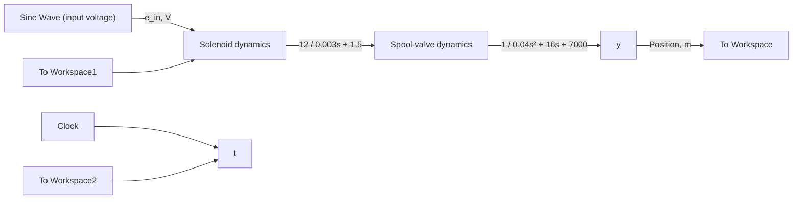

Figure 9.13 shows the Simulink block diagram of the actuator–valve system where the transfer functions $G _ { 1 } ( s )$ and $G _ { 2 } ( s )$ are readily apparent (i.e., see Fig. 9.12). The sinusoidal voltage input is created by using the Sine Wave block (Sources library) with amplitude of 6 (V) and frequency of 62.8319 (rad/s). Figure 9.14 shows the complete response of the valve position y(t) for the sinusoidal input. The first-order solenoid has a time constant $\tau = 0 . 0 0 3 / 1 . 5 = 0 . 0 0 2 \mathrm { s }$ and, therefore, its contribution to the transient response dies out in about 0.008 s (i.e., four time constants). The damping ratio and undamped natural frequency of the spool valve are $\zeta = 0 . 4 7 8 1$ and $\omega _ { n } = 4 1 8 . 3 3$ rad/s, respectively. Consequently, the transient-response contribution from the second-order valve dynamics dies out at time $t _ { S } = 4 / ( \zeta \omega _ { n } ) = 0 . 0 2 \mathrm { s }$ , which is much sooner than one period of the input voltage signal (0.1 s for f = 10 Hz). Figure 9.14 shows that the amplitude of the steady-state valve position $y _ { \mathrm { s s } } ( t )$ is about 0.0069 m, which verifies Eq. (9.40). Furthermore, Fig. 9.14 shows very little phase lag between the input and output sinusoids. The time shift is $\Delta t = | \phi / \omega | = 0 . 0 0 4 3 \mathrm { s }$ , which matches the time lag between the input and output “peaks” or “valleys” in Fig. 9.14.

flowchart

Figure 9.13 Simulink model of actuator–valve system (Example 9.4).

line

| Time, s | Input voltage, e_in(t), V | Spool-valve position, y(t), m |
| --- | --- | --- |
| 0.00 | 0.0 | 0.0 |
| 0.05 | 6.0 | 0.005 |
| 0.10 | -6.0 | -0.01 |
| 0.15 | 6.0 | 0.005 |
| 0.20 | -6.0 | -0.01 |
| 0.25 | 6.0 | 0.005 |
| 0.30 | 0.0 | 0.0 |

Figure 9.14 Spool-valve response to a sinusoidal voltage input (Example 9.4).
