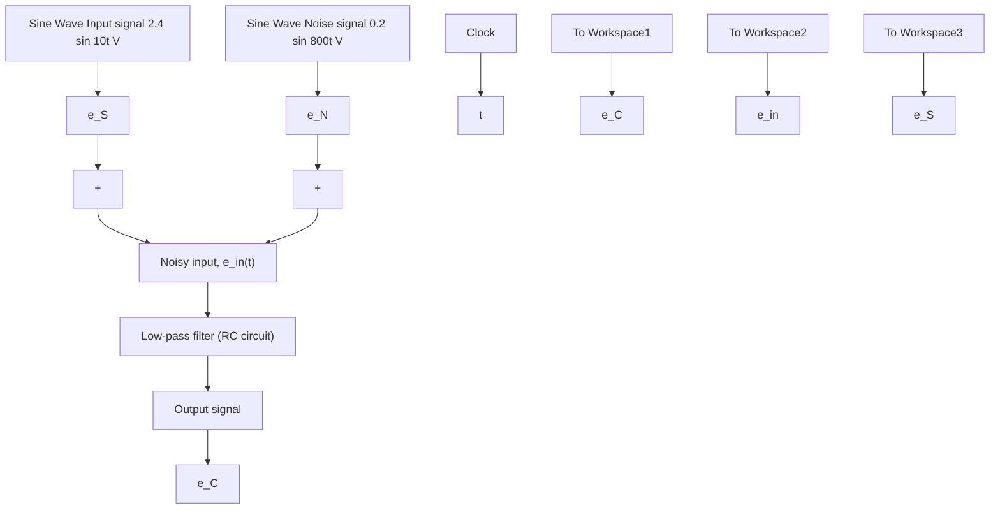

# Example 9.7

Consider again the RC circuit in Fig. 9.19 with capacitance $C = 0 . 0 0 3 \mathrm { ~ F ~ }$ and resistance $R = 4 \Omega$ . Suppose the input voltage is the sum of two sinusoidal signals

$$e _ {\mathrm{in}} (t) = e _ {S} (t) + e _ {N} (t)$$

where $e _ { S } ( t ) = 2 . 4$ sin 10t V is the desired input signal and $e _ { N } ( t ) = 0 . 2$ sin 800t V is an undesirable high-frequency “noise” signal. Simulate the response of the RC circuit to the noisy input and discuss the performance of the low-pass filter.

Figure 9.21 shows the Simulink model of the RC circuit (or, low-pass filter). Note that the noisy voltage input $e _ { \mathrm { i n } } ( t )$ is created by summing two Sine Wave sources where the input signal has an amplitude of 2.4 V and frequency $\omega = 1 0$ rad/s (1.6 Hz) and the noise signal has an amplitude of 0.2 V and frequency $\omega = 8 0 0$ rad/s (127.3 Hz). Figure 9.22 shows the desired input signal $e _ { S } ( t )$ and the noisy input signal $e _ { \mathrm { i n } } ( t )$ on the same graph. Note that the long-wavelength “clean” signal $e _ { S } ( t )$ is difficult to see in Fig. 9.22a as it is surrounded by the highfrequency noise; Fig. 9.22b shows an expanded view of the input signal near $t = 0 . 8 \ : \mathrm { s }$ where both the low- and high-frequency signals are observable. The noisy signal $e _ { \mathrm { i n } } ( t )$ shown in Fig. 9.22 is the input to the low-pass

flowchart

Figure 9.21 Simulink model of RC circuit or low-pass filter (Example 9.7).

line

| Time, s | Signal, e_S(t) (V) | e_in(t) (V) |
| --- | --- | --- |
| 0.65 | ~0.0 | ~0.5 |
| 0.70 | ~2.5 | ~1.5 |
| 0.75 | ~-2.5 | ~2.0 |
| 0.80 | ~2.5 | ~2.5 |
| 0.85 | ~-2.5 | ~2.0 |
| 0.90 | ~-2.5 | ~1.0 |
| 0.95 | ~2.5 | ~0.5 |

Figure 9.22 Desired input signal $e _ { S } ( t )$ and noisy signal $e _ { \mathrm { i n } } ( t )$ (Example 9.7).
