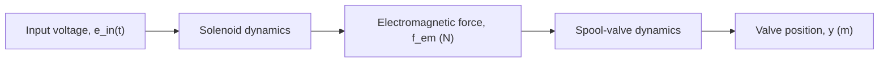

Figure 10.2 shows a general closed-loop feedback control system. The block labeled plant denotes the physical system to be controlled and is usually represented by one or more transfer functions or a state-space representation (SSR). Using our system in Fig. 10.1 as an example, the spool-valve transfer function would represent the plant or system to be controlled. The block labeled sensor in Fig. 10.2 denotes the physical measuring device that allows feedback information. For example, a linear variable differential transformer (LVDT) is an electromechanical device that measures translational displacement. The sensor block in Fig. 10.2 could either be a transfer function if the physical device exhibits a dynamic response or a simple gain if the sensor output is proportional to its input. The controller block in Fig. 10.2 denotes the control logic (or control rules) and the physical actuating device that controls the plant and is usually represented by one or more transfer functions. The solenoid in Fig. 10.1 would be the physical actuating device because it drives the plant (spool valve, in this case). The control logic that determines the voltage input to the solenoid actuator is also part of the controller block. For real-world control systems, the control logic typically resides in a computer or a microprocessor. The input to the controller block is usually an error signal, which is the difference between the reference command (desired output) and the actual system output (feedback signal) as measured by the sensor. The output of the controller is the control signal that drives the plant and (if designed properly) ultimately produces a system output that matches the desired reference command (i.e., a zero error signal). Finally, the plant may be subjected to disturbance inputs from the operating environment such as winds, vibrations, etc.

flowchart

Figure 10.1 Open-loop system: solenoid actuator and spool valve.

flowchart

