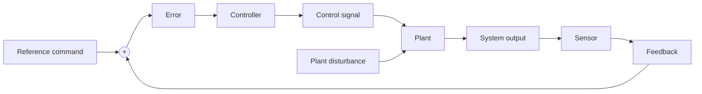

Figure 10.2 General closed-loop feedback control system.

Cruise control for an automobile is a good illustration of the closed-loop feedback structure shown in Fig. 10.2. The driver manually brings the automobile to the desired speed and presses a button to engage the cruise control, which therefore sets the reference command (desired speed). A speed sensor measures the actual speed of the automobile and this feedback signal is compared to the reference command to form a velocity error signal. The control-logic rules reside in a small computer onboard the automobile and the controller “rules” use the velocity error to determine an electronic throttle signal. The control signal (throttle signal) is the input to the engine, which is part of the plant. Because throttle signal is the plant input and speed is the plant output, the plant block in Fig. 10.2 would include models of the engine dynamics, powertrain, road terrain, and aerodynamic drag. The presence of uphill or downhill roads or winds would be examples of disturbance inputs to the plant.

The purpose of an automobile cruise control system is to automatically maintain a desired speed. We can list general performance requirements that dictate the design of feedback control systems:

1. Stability margins: the closed-loop system must demonstrate stable operation where the system output remains bounded for all bounded reference commands.   
2. Speed of response: for example, the control system must quickly respond to a new reference command.   
3. Good damping characteristics: for example, a good controller design for a cruise-control system should result in very low overshoot as the automobile’s actual speed approaches the desired reference speed.   
4. Little or no steady-state error (tracking): for example, a good cruise-control design would produce very small velocity error (good “tracking”) at steady state.   
5. Disturbance rejection: the closed-loop system should compensate for disturbance inputs and demonstrate adequate performance (i.e., good response speed, tracking, etc.).
