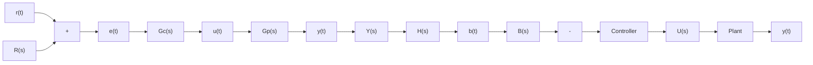

# Control System Transfer Functions

Figure 10.3 shows a simple closed-loop control system, which is essentially the same as Fig. 10.2 except that the controller, plant, and sensor blocks are represented by the single-input, single-output (SISO) transfer functions $G _ { C } ( s ) , G _ { P } ( s )$ , and H(s), respectively. Note also that the respective path signals are labeled as both time- and Laplace-domain functions. The reader should recall that we labeled the path signals as time functions in the block diagrams discussed in Chapter 5 and the Simulink diagrams presented in Chapter 6. We choose to switch back and forth between labeling signals as either time- or Laplace-domain functions when it is convenient to do so. For example, we use time-domain signals for Simulink diagrams and Laplace-domain signals when we use and manipulate transfer functions.

The following transfer functions are now defined using Fig. 10.3. The forward transfer function is $G ( s ) = G _ { C } ( s ) G _ { P } ( s )$ . In other words, the forward transfer function contains all transfer functions in the forward path (controller and plant), and therefore relates the error signal e(t) to the system output y(t). The sensor transfer function H(s) is the feedback transfer function. The open-loop transfer function is G(s)H(s). Hence, the open-loop transfer function is the product of all transfer functions in the forward and feedback paths.

Figure 10.4a shows the closed-loop system in Fig. 10.3, with G(s) replacing the controller and plant transfer functions in the forward loop. Let us develop a transfer function that relates the system output y(t) to the reference input r(t). To begin, we see that system output (in the Laplace domain) is the product of the forward transfer G(s) and the error signal E(s)

$$Y (s) = G (s) E (s) = G (s) [ R (s) - B (s) ] \tag {10.1}$$

flowchart

Figure 10.3 Closed-loop feedback control system.

