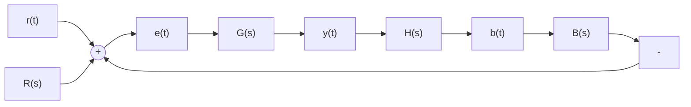
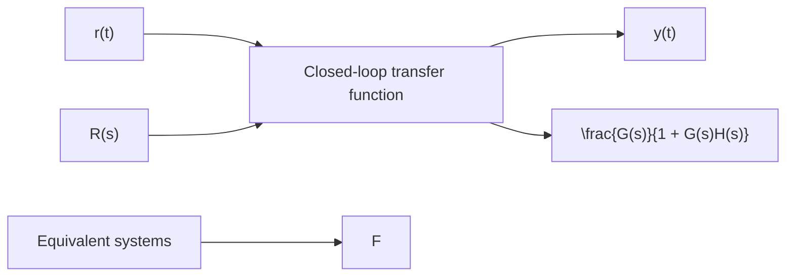

flowchart

(a)

flowchart

(b)   
Figure 10.4 Closed-loop systems: (a) system with forward and feedback paths and (b) equivalent closed-loop system.

However, Fig. 10.4a shows that the feedback-path signal is $B ( s ) = H ( s ) Y ( s )$ and therefore Eq. (10.1) becomes

$$Y (s) = G (s) [ R (s) - H (s) Y (s) ] \tag {10.2}$$

Moving the terms involving the output to the left-hand side, we obtain

$$Y (s) [ 1 + G (s) H (s) ] = G (s) R (s) \tag {10.3}$$

Finally, solving Eq. (10.3) for the ratio of system output Y(s) to reference input R(s) yields

$$T (s) = \frac {Y (s)}{R (s)} = \frac {G (s)}{1 + G (s) H (s)} \tag {10.4}$$

Equation (10.4) is an extremely important result in analyzing closed-loop systems. The transfer function T(s) in Eq. (10.4) is the closed-loop transfer function and it relates the overall system output y(t) to the overall system input $r ( t )$ . Consequently, we can replace the closed-loop system shown in Fig. 10.4a by a single transfer function as shown in Fig. 10.4b. It should be emphasized that the two systems shown in Fig. 10.4 are equivalent. Once we derive the closed-loop transfer function, we can evaluate the closedloop response characteristics by computing the poles of $T ( s )$ . In other words, computing the roots of the denominator polynomial (i.e., $1 + G ( s ) H ( s ) = 0 )$ determines the closed-loop poles and the time constants, damping ratio, natural frequency, etc., associated with the closed-loop system. We can apply the various methods developed in Chapters 7–9 to analyze the closed-loop system’s response to step, impulse, and sinusoidal inputs.

MATLAB can compute the closed-loop transfer function using the feedback command. The user must define the forward and feedback transfer functions G(s) and H(s) (see Fig. 10.4a), respectively:

>> sysG = tf (numG, denG) % create forward transfer function G(s)
>> sysH = tf (numH, denH) % create feedback transfer function H(s)
>> sysT = feedback (sysG, sysH) % compute closed-loop transfer function T(s)

Of course, the user must define the numerator and denominator polynomials for G(s) and H(s), such as numG and denG. The feedback command assumes a negative feedback sign at the summing junction, as shown in Fig. 10.4a.
