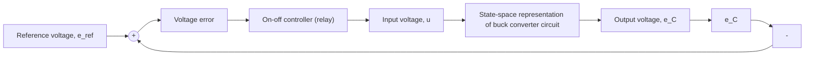

Figure 10.8 shows a diagram of the closed-loop system using the on–off controller described by Eq. (10.10). Capacitor voltage $e _ { C }$ is fed back and compared to the reference voltage $e _ { \mathrm { r e f } }$ to form the voltage error. The relay block in Fig. 10.8 denotes the on–off switching: the x-axis of the relay block is the input, while the y-axis is the output. Note that when the voltage error is positive or zero (i.e., $e _ { \mathrm { r e f } } - e _ { C } \geq 0 )$ , Eq. (10.10) and the relay symbol in Fig. 10.8 indicate that the switch is in position “1” and the supply voltage $e _ { \mathrm { i n } }$ is connected to the energy-storage elements. When voltage error is negative, the switch is in position $" 2 "$ and the supply voltage is disconnected from the circuit $( \mathrm { i } . \mathrm { e } . , u = 0 )$ ). Figure 10.8 shows that an SSR is used to denote the plant or input-output relationship of the buck converter system dynamics where the two state variables are capacitor voltage $e _ { C }$ and inductor current $I _ { L }$ .

Figure 10.9 shows a Simulink model that represents the closed-loop system (Fig. 10.8). The Relay block is found in the Discontinuities Simulink library and the “on” and “off” output values are set to $e _ { \mathrm { i n } } ( 2 8 \mathrm { V } )$ ) and zero, respectively. The state-equation matrices A and B are appropriately defined using Eq. (10.9); however, the output matrix C is set to an identity matrix so that both states (capacitor voltage and inductor current) can be plotted. Figures 10.10 and 10.11 show the closed-loop responses for capacitor voltage $e _ { C } ( t )$ and inductor current $I _ { L } ( t )$ . We see that the on–off controller drives capacitor voltage to the desired reference voltage (12 V) in about 0.007 s (or 7 ms). Inductor current (Fig. 10.11) exhibits a sharp rise from zero and “jagged” chatter about a steady-state value of 3 A. The jagged current response can be explained by observing the dynamic equation for the inductor voltage:

flowchart

