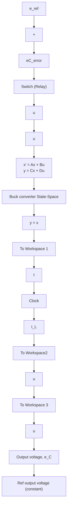

Figure 10.8 Buck converter circuit using an on–off controller (Example 10.4).

flowchart

Figure 10.9 Simulink diagram of the buck converter circuit (Example 10.4).

$$L \dot {I} _ {L} = u - e _ {C}$$

and therefore the time-rate ${ \dot { I } } _ { L }$ is nearly constant and equal to (28 − 12 V)∕18 mH when the switch is in position $1 \ ( u = 2 8 \mathrm { V } )$ and $e _ { C } \approx 1 2 \mathrm { V } .$ When the switch is in position 2 (u = 0) and $e _ { C } \approx 1 2 \ : \mathrm { V } ,$ , the slope ${ \dot { I } } _ { L }$ is –12 V/18 mH. Figure 10.12 shows the input voltage u(t) to the circuit as dictated by the on–off controller equation (10.10). Clearly, the input voltage switches between 28 V (supply voltage $e _ { \mathrm { i n } } )$ and zero as the capacitor voltage $e _ { C } ( t )$ ) crosses the 12-V reference voltage as seen in Fig. 10.10. Current $I _ { L } ( t )$ switches from positive to negative slope as the input voltage switches from 28 to 0 V. Figure 10.12 also shows that the input voltage exhibits “chatter” or very rapid switching between 28 V (on) and 0 V (off) in order to maintain the desired 12-V capacitor voltage. If the switch remained on, then the capacitor would eventually reach 28 V; and if the switch remained off, the resistor would eventually dissipate all energy stored in the electrical system. This high-frequency input “chatter” can be an undesirable consequence of using on–off controllers.

line

| Time, s | Capacitor voltage, e_C(t), V |
| --- | --- |
| 0.000 | 0.0 |
| 0.002 | 8.0 |
| 0.004 | 13.5 |
| 0.006 | 12.0 |
| 0.008 | 12.0 |
| 0.010 | 12.0 |
| 0.012 | 12.0 |

Figure 10.10 Capacitor voltage response $e _ { C } ( t )$ (Example 10.4).

line

| Time, s | Inductor current, I_L(t), A |
| --- | --- |
| 0.000 | 0.0 |
| 0.002 | 3.9 |
| 0.004 | 2.5 |
| 0.006 | 3.3 |
| 0.008 | 2.8 |
| 0.010 | 3.0 |
| 0.012 | 3.0 |

Figure 10.11 Inductor current response $I _ { L } ( t )$ (Example 10.4).   

line

| Time, s | Input voltage, u(t), V |
| --- | --- |
| 0.000 | 28 |
| 0.003 | 28 |
| 0.005 | 0 |
| 0.006 | 28 |
| 0.007 | 28 |
| 0.008 | 28 |
| 0.009 | 28 |
| 0.010 | 28 |
| 0.011 | 28 |
| 0.012 | 28 |

Figure 10.12 Input voltage u(t) (Example 10.4).
