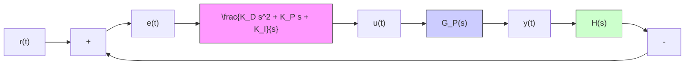

1. Proportional control term, $K _ { P } e ( t ) \colon$ : The control signal is proportional to the instantaneous error. Increasing the P-gain $K _ { P }$ will tend to speed up the system response. The proportional control term has a diminished effect as the feedback error goes to zero (i.e., good tracking at steady state).   
2. Integral control term, $K _ { I } \int e ( t ) d t \colon$ The control signal is proportional to the summation (integral) of all past error signals and therefore the integral control term will be nonzero even when the feedback error goes to zero. For this reason, integral control is used to reduce the steady-state tracking error.   
3. Derivative control term, $K _ { D } \dot { e } ( t )$ : The control signal is proportional to the instantaneous derivative of the error signal. Hence, the derivative control signal “anticipates” the system response because it is based on the derivative or time rate of the error signal. In general, increasing the D-gain $K _ { D }$ reduces overshoot and adds damping to the closed-loop system.

In many cases a subset of the PID controller is used. For example, if a particular system has sufficient damping, we may not need the derivative control term and consequently we set the D-gain $K _ { D }$ to zero. As another example, some plants may include a “natural integrator” in their system dynamics and therefore may not require an additional integral control term for a good steady-state response, in which case we can set $K _ { I } = 0$ . In these cases we may choose to utilize a controller with only one or two terms, such as a P-controller, PI controller, or PD controller. We illustrate the various attributes of the PID controller and its variations in the example problems in this section and in the sections to follow.

flowchart

Figure 10.14 PID controller $G _ { C } ( s )$ in a closed-loop system.

We can derive the PID controller transfer function by expressing the control logic equation (10.11) using the Laplace variable s
