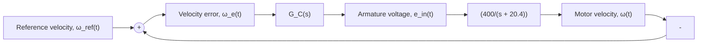

# Example 10.5

Figure 10.15 shows a closed-loop system for controlling the angular velocity of a DC motor. Investigate and compare the closed-loop speed responses using proportional and proportional-integral controllers.

Before we analyze the closed-loop system shown in Fig. 10.15, we note some of its features. First, the DC motor (plant) dynamics are modeled by the first-order system derived in Example 10.3, where coil inductance

flowchart

Figure 10.15 Closed-loop control system for DC motor (Example 10.5).

L has been ignored. The input to the DC motor transfer function is armature voltage $e _ { \mathrm { i n } } ( t )$ and the output is angular velocity ??. Figure 10.15 shows a “unity-feedback” system, where $H ( s ) = 1$ and the overall system output (angular velocity in rad/s) is fed back and compared directly to the reference velocity command (also in rad/s). It is important to note that signals that are compared at a summing junction must have the same units. Before microprocessors became commonplace in control systems, the angular velocity would typically be measured by a tachometer that converts the speed in rad/s to a voltage signal. This feedback voltage signal would be compared to a reference voltage signal that is proportional to the reference angular velocity $\omega _ { \mathrm { r e f } } .$ . An amplifier gain would be present in the controller $G _ { C } ( s )$ in order to boost the low-voltage error signal and create armature voltage $e _ { \mathrm { i n } } ( t )$ . Because the same speed-to-voltage conversion gain (V-s/rad) would be applied to ?? and $\omega _ { \mathrm { r e f } } ,$ , we can factor out this common gain and assume a unity-feedback structure. With the advent of microprocessors and digital sensors, we can assume that the measured and commanded variables can have any units (such as rad/s, in this case). As long as we have common units at the feedback summing junction, we can usually utilize a unity-feedback system as shown in Fig. 10.15.
