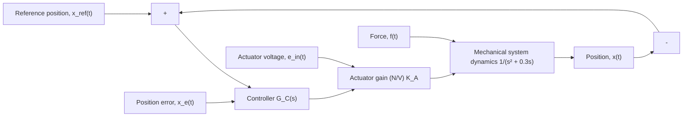

# Example 10.6

Figure 10.18 shows the closed-loop position control for a simple mechanical system modeled by a mass–damper system (mass m = 1 kg and viscous friction $b = 0 . 3 \mathrm { N - s / m } )$ . Investigate and compare the use of proportional and proportional-derivative controllers for a reference step position command $x _ { \mathrm { r e f } } ( t ) = 0 . 1 ~ \mathrm { m }$ .

The controller $G _ { C } ( s )$ in Fig. 10.18 uses the feedback position error $x _ { e } ( t )$ to generate the voltage input $e _ { \mathrm { i n } } ( t )$ to an actuator device, which in turn produces the force $f ( t )$ that is applied directly to the mechanical mass–damper system. We have neglected the actuator dynamics (they are very fast compared to the mechanical system) and therefore modeled the actuator as a simple gain $K _ { A }$ with units N/V. Figure 10.18 might represent the position control of a machine tool in a manufacturing process.

Using the block diagram in Fig. 10.18, the closed-loop transfer function for any controller is

$$T (s) = \frac {K _ {A} G _ {C} (s) G _ {P} (s)}{1 + K _ {A} G _ {C} (s) G _ {P} (s)} \tag {10.19}$$

flowchart

Figure 10.18 Closed-loop position control of a mechanical system (Example 10.6).

where $G _ { P } ( s )$ is the mechanical system transfer function. Using the fixed actuator gain $K _ { A } = 2 \mathrm { N } / \mathrm { V }$ and a P-controller $( G _ { C } ( s ) = K _ { P } )$ , the closed-loop transfer function becomes

$$T (s) = \frac {\frac {2 K _ {P}}{s ^ {2} + 0 . 3 s}}{1 + \frac {2 K _ {P}}{s ^ {2} + 0 . 3 s}} = \frac {2 K _ {P}}{s ^ {2} + 0 . 3 s + 2 K _ {P}} \tag {10.20}$$

Immediately we see that the DC gain of $T ( s )$ is always unity for any nonzero control gain $K _ { P }$ and therefore a P-controller will provide perfect steady-state tracking for a step position input. However, the transient response of the system using proportional control is very poor. To see this, note the closed-loop characteristic equation or denominator of $T ( s )$

$$s ^ {2} + 0. 3 s + 2 K _ {P} = 0 \tag {10.21}$$
