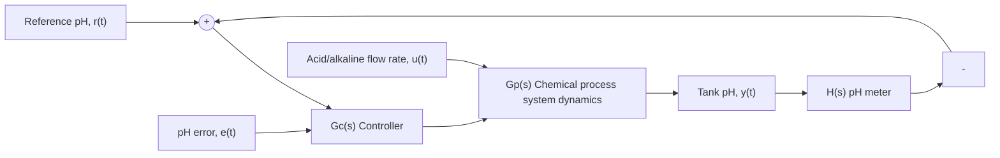

# Example 10.7

Figure 10.22 shows a closed-loop system for controlling the pH balance in a chemical-processing system. The pH level of a solution in a stirred reaction tank is measured by a pH meter and fed back to form the pH error. The controller $G _ { C } ( s )$ uses the pH error to determine the acid/alkaline mixture ratio u(t) of the input flow stream to the tank (if $u > 0$ the input flow is alkaline, if $u < 0$ the input flow is acidic). Use the Ziegler–Nichols tuning rules to design a PID controller that provides a good closed-loop response for a step reference pH command $r ( t ) = 9$ (alkaline) if the solution in the tank is initially neutral $\mathrm { ( p H } = 7 )$ ).

flowchart

Figure 10.22 Closed-loop pH control of a chemical-processing system (Example 10.7).
