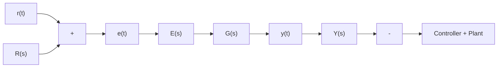

# 10.4 STEADY-STATE ACCURACY

In Section 10.2, we stated that good steady-state tracking is a desirable attribute of most feedback control systems. In addition, the previous discussion of PID controllers demonstrates that inserting an integral control signal generally improves the steady-state accuracy, or the steady-state error between the commanded reference signal and the system response. We present a systematic method for determining the steady-state accuracy of a linear closed-loop system when the reference signal is a step, ramp, and parabolic input function.

Figure 10.26 presents a unity-feedback $( \mathrm { i . e . , } H ( s ) = 1 )$ ) system where the forward transfer function is the product of the controller and plant transfer functions, or $G ( s ) = G _ { C } ( s ) G _ { P } ( s )$ . The tracking error in the time domain is $e ( t ) \ ( \mathrm { o r } , E ( s )$ in the Laplace domain) and it is the difference between the reference command and the system output:

$$e (t) = r (t) - y (t) \quad \text { or } \quad E (s) = R (s) - Y (s) \tag {10.24}$$

If we divide Eq. (10.24) by the Laplace transform of the reference signal, we obtain

$$\frac {E (s)}{R (s)} = 1 - \frac {Y (s)}{R (s)} \tag {10.25}$$

flowchart

Figure 10.26 Unity-feedback closed-loop system.

Substituting the closed-loop transfer function $Y ( s ) / R ( s ) = G ( s ) / [ 1 + G ( s ) ]$ yields

$$\frac {E (s)}{R (s)} = 1 - \frac {G (s)}{1 + G (s)} = \frac {1 + G (s)}{1 + G (s)} - \frac {G (s)}{1 + G (s)} \tag {10.26}$$

Finally, the transfer function relating tracking error to the reference command is

$$\frac {E (s)}{R (s)} = \frac {1}{1 + G (s)} \tag {10.27}$$

Equation (10.27) can be used to compute the Laplace transform of the tracking error

$$E (s) = \frac {1}{1 + G (s)} R (s) \tag {10.28}$$

Recall that the final-value theorem can be used to compute the final (or steady-state) tracking error

$$e (\infty) = \lim _ {t \to \infty} e (t) = \lim _ {s \to 0} s E (s) \tag {10.29}$$

Or, using Eq. (10.28)

$$e (\infty) = \lim _ {s \to 0} \frac {s R (s)}{1 + G (s)} \tag {10.30}$$
