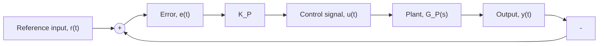

# Example 10.9

Figure 10.30 shows a closed-loop system with proportional control and plant dynamics represented by $G _ { P } ( s )$ . Use MATLAB to determine the closed-loop stability for control gains in the range $0 < K _ { P } \leq 2 5 0$ .

Note that the plant $G _ { P } ( s )$ is identical to the transfer function (10.35) and the example from the previous discussion on stability. In order to check the stability of the closed-loop system, we must calculate the closed-loop transfer function:

$$T (s) = \frac {K _ {P} G _ {P} (s)}{1 + K _ {P} G _ {P} (s)} = \frac {K _ {P}}{0 . 5 s ^ {3} + 4 s ^ {2} + 2 3 s + 3 4 + K _ {P}} = \frac {Y (s)}{R (s)}$$

The following MATLAB commands will compute the closed-loop poles of T(s) for the gain $K _ { P } = 1$

```matlab
>> Kp = 1; % proportional gain setting
>> denT = [0.5 4 23 (34+Kp)]; % denominator of closed-loop T(s)
>> CLpoles = roots(denT) % compute closed-loop poles 
```


<details>
<summary>flowchart</summary>


</details>

Figure 10.30 Closed-loop control system (Example 10.9).

Table 10.4 Stability Analysis of the Closed-Loop System in Fig. 10.30 (Example 10.9)

<table><tr><td>Control Gain,  $K_{P}$ </td><td>Closed-Loop Poles</td><td>Stability Status</td></tr><tr><td>1</td><td> $s_{1} = -2.0774, s_{2,3} = -2.9613 \pm j4.9927$ </td><td>Stable</td></tr><tr><td>50</td><td> $s_{1} = -5.3009, s_{2,3} = -1.3495 \pm j5.4655$ </td><td>Stable</td></tr><tr><td>100</td><td> $s_{1} = -6.9377, s_{2,3} = -0.5312 \pm j6.1925$ </td><td>Stable</td></tr><tr><td>150</td><td> $s_{1} = -8.0, s_{2,3} = \pm j6.7823$ </td><td>Marginally stable</td></tr><tr><td>200</td><td> $s_{1} = -8.8091, s_{2,3} = 0.4045 \pm j7.2776$ </td><td>Unstable</td></tr><tr><td>250</td><td> $s_{1} = -9.4734, s_{2,3} = 0.7367 \pm j7.7081$ </td><td>Unstable</td></tr></table>
