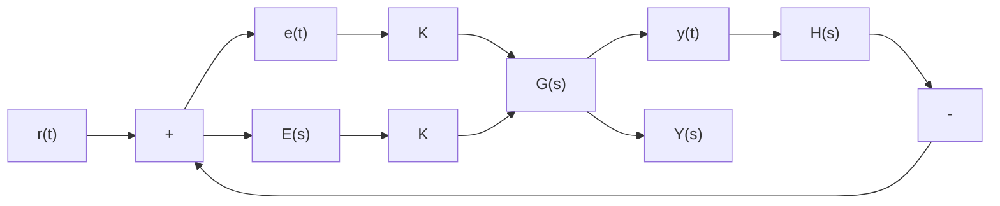

The root-locus method is the graphical procedure for constructing the root locus (such as Fig. 10.32) and is based only on the knowledge of the open-loop poles and zeros. We can derive the fundamental condition that determines whether or not a particular complex value $s _ { 1 }$ is on the root locus by considering the very general closed-loop system shown by Fig. 10.33. Recall that the root locus is a plot of the paths followed by the closed-loop roots (poles) as a single parameter is varied. In Fig. 10.33 we have included the very general case where the parameter to be varied, control gain K, is in the forward path. The reader should note that the forward transfer function $G ( s )$ contains both the controller dynamics (such as PID) and the plant dynamics. Using Eq. (10.4), the closed-loop transfer function is

$$T (s) = \frac {Y (s)}{R (s)} = \frac {K G (s)}{1 + K G (s) H (s)} \tag {10.38}$$

flowchart

Figure 10.33 General closed-loop system with forward-path gain K.

The denominator of the closed-loop transfer function T(s) is the characteristic equation that defines the location of the closed-loop poles (roots):

$$\text { Characteristic equation: } \quad 1 + K G (s) H (s) = 0$$

or, solving for the open-loop transfer function

$$G (s) H (s) = \frac {- 1}{K} \tag {10.39}$$

In general, the open-loop transfer function $G ( s ) H ( s )$ is a complex function of the complex variable s; that is, it consists of real and imaginary components. Therefore, we can rewrite Eq. (10.39) as two conditions: the angle condition and the magnitude condition. Because $G ( s ) H ( s ) = - 1 / K$ is a real negative number (for positive gain $K > 0 )$ ), the argument or phase angle of $G ( s ) H ( s )$ must be $1 8 0 ^ { \circ }$ . Therefore, the angle condition is

$$\text { Angle condition: } \angle (G (s) H (s)) = 1 8 0 ^ {\circ} + r 3 6 0 ^ {\circ}, \quad r = 0, \pm 1, \pm 2, \dots \tag {10.40}$$

Likewise, because $G ( s ) H ( s ) = - 1 / K$ is a real negative number, its magnitude is

$$\text { Magnitude condition: } \quad | G (s) H (s) | = \frac {1}{K} \tag {10.41}$$
