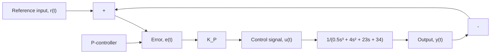

# Example 10.10

Consider again the unity-feedback control system from Example 10.9. Figure 10.35 shows the closed-loop system with proportional control and plant dynamics represented by G(s). Use the root-locus construction rules to develop the basic structure of the root locus and use MATLAB to create the root locus. Finally, use the root-locus plot to characterize the closed-loop transient response and closed-loop stability.

flowchart

Figure 10.35 Closed-loop control system (Example 10.10).

The root locus solely depends on the open-loop transfer function, which is

$$G (s) H (s) = \frac {1}{0 . 5 s ^ {3} + 4 s ^ {2} + 2 3 s + 3 4} \tag {10.43}$$

The three open-loop poles are $p _ { 1 } = - 2 \mathrm { a n d } p _ { 2 , 3 } = - 3 \pm j 5$ . There are no finite open-loop zeros because the numerator of $G ( s ) H ( s )$ is a constant. Hence, a sketch of the root locus would begin with three open-loop “×” markers in the complex plane at −2 (negative real axis) and $- 3 \pm j 5$ (complex). Rule 6 states that the real-axis root-locus branch exists if an odd number of open-loop poles and zeros are to the right. Because the only real open-loop pole is $p _ { 1 } = - 2$ and no zeros exist, all points on the real axis to the left of –2 constitute a branch of the root locus. Furthermore, all points on the real axis to the right of –2 can never be part of the root locus because there are no open-loop poles or zeros to the right of $p _ { 1 } = - 2$ (zero is an even number). Rule 5 states that the asymptotes intersect the real axis at

$$\sigma_ {a} = \frac {\sum_ {i = 1} ^ {n} p _ {i} - \sum_ {j = 1} ^ {m} z _ {j}}{n - m} = \frac {(- 2) + (- 3 + j 5) + (- 3 - j 5)}{3} = \frac {- 8}{3}$$

The three asymptote angles are

$$\theta_ {1, 2} = \pm \frac {1 8 0 ^ {\circ}}{3} = \pm 6 0 ^ {\circ} \text { and } \theta_ {3} = \pm \frac {3 (1 8 0 ^ {\circ})}{3} = \pm 1 8 0 ^ {\circ}$$

Hence, two asymptotes emanate outward from $\sigma _ { a } = - 8 / 3$ at angles $\theta _ { 1 , 2 } = \pm 6 0 ^ { \circ }$ and the third asymptote $( \theta _ { 3 } = \pm 1 8 0 ^ { \circ } )$ is along the negative real axis.

The following MATLAB commands create the accurate root-locus plot:
