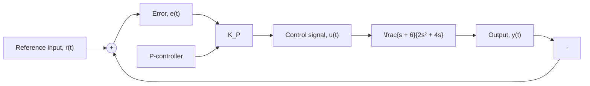

Figure 10.38 shows MATLAB’s construction of the root locus for the closed-loop control system in Fig. 10.37. The two open-loop poles and single open-loop zero are clearly identified by the $\bar { \cdots } \times \vec { \cdots }$ and $" \mathrm { o } ^ { , \mathrm { i } , \mathrm { i } }$ markers. The two closed-loop poles begin at $s = 0$ and $s = - 2$ for the gain $K _ { P } = 0$ and move toward each other along the negative real axis as the gain increases. When the P-gain is $K _ { P } = 0 . 4 0 4$ , the two closed-loop roots meet at approximately $s = - 1 . 1$ . For gains in the range $0 . 4 0 4 < K _ { P } < 3 9 . 5 9 \dot { 6 }$ , the two closed-loop roots are complex and their branches follow semicircular arcs that are symmetric about the real axis. When the gain is $K _ { P } = 3 9 . 5 9 6 .$ , the two roots enter the negative real axis at approximately $s = - 1 0 . 9$ . As the gain is increased beyond 39.6, one closed-loop root moves left along the negative real axis to −∞ and the other closed-loop root moves right and eventually terminates at the open-loop zero located at $s = - 6$ .

flowchart

Figure 10.37 Closed-loop control system (Example 10.11).

scatter

| Point | Real Axis | Imaginary Axis |
| --- | --- | --- |
| o | -6 | 0 |
| x | -2 | 0 |

Figure 10.38 Root-locus plot for Example 10.11.
