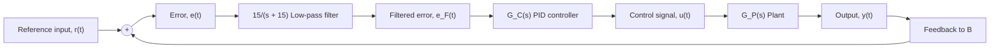
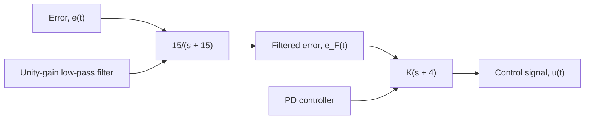
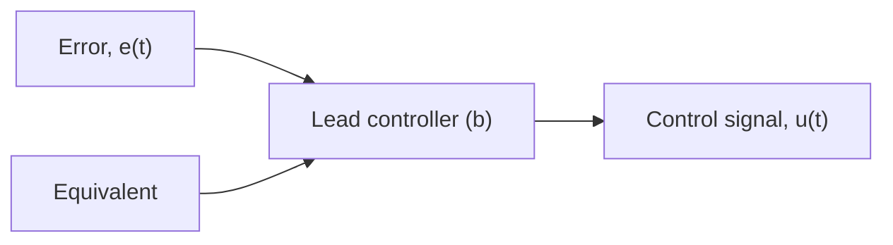

Suppose we choose to implement a PD controller with an open-loop zero at s = −4 that is preceded by a low-pass filter with corner frequency $\omega _ { c } = 1 5 \mathrm { r a d / s }$ . Figure 10.46a shows this controller structure with the unity-gain low-pass filter $G _ { \mathrm { L P } } ( s )$ and PD controller $G _ { C } ( s )$ in series. The product of the low-pass filter and PD controller is

$$G _ {\mathrm{LP}} (s) G _ {C} (s) = \frac {1 5}{s + 1 5} K (s + 4) \tag {10.52}$$

We can factor the low-pass filter’s numerator gain (=15) into the arbitrary control gain $K _ { 1 } = 1 5 K$ to yield

$$G _ {\mathrm{LF}} (s) = \frac {K _ {1} (s + 4)}{s + 1 5} \tag {10.53}$$

The controller presented by Eq. (10.53) and shown in Fig. 10.46b is called a lead controller or lead filter. The name arises from the fact that this transfer function adds phase lead at low frequencies. Figure 10.47 shows the Bode diagram for the following PD and lead controllers:

$$
\begin{array}{l l} \text {PD controller:} & 0. 2 5 (s + 4) \\ \text {Lead controller:} & \frac {3 . 7 5 (s + 4)}{s + 1 5} \end{array}
$$

flowchart

Figure 10.45 PID controller with low-pass filter 15/(s + 15).

flowchart

flowchart

Figure 10.46 Equivalent controllers: (a) low-pass filter + PD controller and (b) lead controller.   

line

