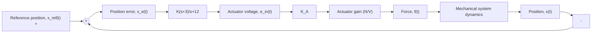

# Example 10.13

Consider again the closed-loop position-control system presented in Fig. 10.48 (Examples 10.6, 10.8, and 10.12). Use the root locus to design a lead controller $G _ { \mathrm { L F } } ( s )$ that provides a fast, well-damped closed-loop transient response to a reference step position command $x _ { \mathrm { r e f } } ( t ) = 0 . 1$ 1 m. Compare the lead-controller design to the PD controller result from Example 10.12. The actuator gain is $K _ { A } = 2 \mathrm { N } / \mathrm { V } .$ .

Let us use the following lead controller with a zero at s = –3 and pole at $s = - 1 2$

$$G _ {\mathrm{LF}} (s) = \frac {K (s + 3)}{s + 1 2}$$

The reader should remember that we have the freedom to select the zero and pole location of the lead controller. Combining the lead controller and mechanical system plant (with actuator gain $K _ { A } = 2 \mathrm { N } / \mathrm { V } )$ , the open-loop transfer function is

$$G (s) H (s) = \frac {2 (s + 3)}{(s + 1 2) (s ^ {2} + 0 . 3 s)}$$

flowchart

Figure 10.48 Closed-loop position control of a mechanical system (Example 10.13).

Hence, the open-loop transfer function has three poles at s = 0, s = −0.3, and s = −12 and one zero at $s = - 3$ . The following MATLAB commands will create the root-locus plot presented in Fig. 10.49:

>> sysGc = tf([1 3], [1 12]) % create lead controller transfer function
>> sysGp = tf(2, [1 0.3 0]) % create plant transfer function
>> sysGH = sysGc*sysGp % create open-loop transfer function
>> rlocus(sysGH) % create and draw the root locus
