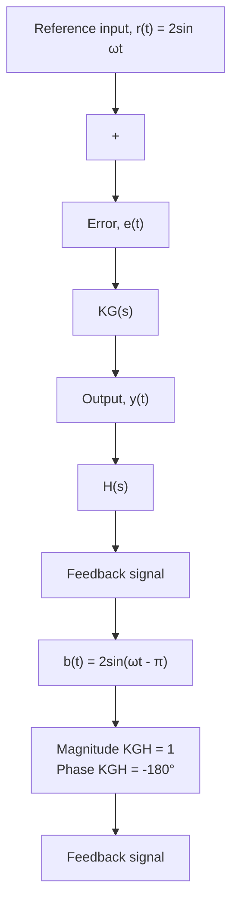

This sinusoidal input is shown in Fig. 10.51. We know from the frequency-response analysis presented in Chapter 9 that the feedback signal b(t) in Fig. 10.51 will also be a sine wave that depends on the magnitude and phase angle of the sinusoidal transfer function $K G ( j \omega ) H ( j \omega )$ . Suppose the magnitude of the open-loop sinusoidal transfer function $K G ( j \omega ) H ( j \omega )$ is unity and the phase angle is $- 1 8 0 ^ { \circ }$ . For this special case, the feedback signal b(t) will be

$$\text { Feedback signal: } \quad b (t) = 2 \sin (\omega t - \pi)$$

flowchart

Figure 10.51 Unstable closed-loop feedback for a sinusoidal reference input.

This sinusoidal feedback signal is shown in Fig. 10.51. Note that feedback $b ( t )$ is the “mirror” opposite of the reference input $r ( t ) ;$ ; that is, $b ( t )$ has the same magnitude as $r ( t )$ but is $1 8 0 ^ { \circ }$ out of phase. Clearly, if this feedback scenario exists, then the error signal $e ( t ) = r ( t ) - b ( t )$ will be a doubling of the reference signal $r ( t )$ . Subsequent feedback of the doubled signal will eventually produce a sinusoidal error signal with infinite amplitude. Therefore, the scenario depicted in Fig. 10.51 is unstable.

The critical condition that leads to the unstable frequency response shown in Fig. 10.51 can now be summarized. The feedback signal $b ( t )$ is the “mirror opposite” of the reference signa $r ( t )$ only if the magnitude $| K G ( j \omega ) H ( j \omega ) | = 1$ and the phase angle $\angle K G ( j \omega ) H ( j \omega ) = - 1 8 0 ^ { \circ }$ . This critical condition can be easily read from the Bode diagram of the open-loop transfer function. Recall that the magnitude plot of the Bode diagram is in decibels and hence the unity magnitude condition is 0 dB.

Let us illustrate the critical unstable condition with a simple example. Suppose we use a simple proportional controller $G _ { C } ( s ) = K _ { P }$ with the following third-order plant

$$\text { Plant: } \quad G (s) = \frac {1}{s (s + 2) (s + 3)} \tag {10.54}$$
