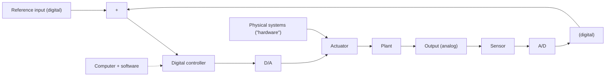
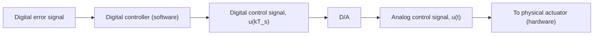

```mermaid
graph LR
    A["Reference input (digital)"] --> B["+"]
    B --> C["Digital controller"]
    C --> D["D/A"]
    D --> E["Actuator"]
    E --> F["Plant"]
    F --> G["Output (analog)"]
    G --> H["Sensor"]
    H --> I["A/D"]
    I --> J["(digital)"]
    J --> B
    K["Computer + software"] -.-> C
    L["Physical systems (&quot;hardware&quot;)"] --> E
```

Figure 10.57 General structure of a digital control system.

flowchart

```mermaid
graph LR
    A["Digital error signal"] --> B["Digital controller (software)"]
    B --> C["Digital control signal, u(kT_s)"]
    C --> D["D/A"]
    D --> E["Analog control signal, u(t)"]
    E --> F["To physical actuator (hardware)"]
```

Figure 10.58 D/A converter using a zero-order hold.
