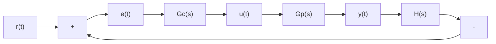
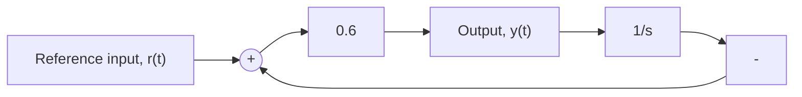
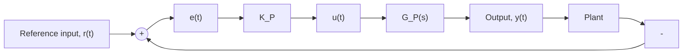

# Conceptual Problems

10.1 Figure P10.1 shows a general feedback control system with forward-path transfer functions $G _ { C } ( s )$ ) (controller) and $G _ { P } ( s )$ (plant) and feedback transfer functions H(s). Given the following transfer functions, determine the closed-loop transfer function $T ( s ) = Y ( s ) / R ( s )$ .

flowchart

Figure P10.1

a. $G _ { C } ( s ) = K _ { P }$ $G _ { P } ( s ) = { \frac { 6 } { s + 2 } } \qquad H ( s ) = 1$   
b. $G _ { C } ( s ) = K _ { P }$ $G _ { P } ( s ) = \frac { 4 } { s ( s + 2 ) } \qquad H ( s ) = 1$   
c. $G _ { C } ( s ) = K _ { P }$ $G _ { P } ( s ) = { \frac { 8 } { s ^ { 2 } ( s + 6 ) } }$ $H ( s ) = 1$   
d. $G _ { C } ( s ) = K _ { P }$ $G _ { P } ( s ) = \frac { 1 } { s ^ { 2 } + 6 s + 1 0 }$ $H ( s ) = 2$   
e. $G _ { C } ( s ) = K _ { P }$ $G _ { P } ( s ) = \frac { 2 } { s + 1 }$ $H ( s ) = \frac { 2 0 } { s + 2 0 }$ s + 1   
f. $G _ { C } ( s ) = K _ { P }$ $G _ { P } ( s ) = \frac { 3 } { s ^ { 2 } + 6 s }$ $H ( s ) = { \frac { 1 0 } { s + 1 0 } }$

${ \bf g . } ~ G _ { C } ( s ) = { \frac { K _ { P } s + K _ { I } } { s } } ~ G _ { P } ( s ) = { \frac { 2 } { ( s + 1 ) ( s + 4 ) } } ~ H ( s ) = 1$

${ \bf h . } ~ G _ { C } ( s ) = K _ { D } s + K _ { P } ~ G _ { P } ( s ) = { \frac { 1 } { s ( s + 3 ) } } ~ H ( s ) = 1$

$\mathbf { i } . \ G _ { C } ( s ) = { \frac { K _ { D } s ^ { 2 } + K _ { P } s + K _ { I } } { s } } \qquad \quad G _ { P } ( s ) = { \frac { 1 } { s ^ { 2 } + 2 s + 6 } } \qquad H ( s ) = 1$

10.2 Figure P10.2 shows a simple closed-loop system. The reference input is a step function, $r ( t ) = 2 U ( t )$ .

flowchart

Figure P10.2

a. Compute the steady-state output, $y ( \infty )$ .   
b. Compute the settling time for the closed-loop system to reach steady state.

10.3 Figure P10.3 shows a general closed-loop control system. The plant transfer function is

$$G _ {P} (s) = \frac {1}{s ^ {2} + 6 s + 8}$$

flowchart

Figure P10.3

a. Determine whether the closed-loop system is stable for control gain $K _ { P } = 2$   
b. Compute the controller gain $K _ { P }$ so that step response shows 25% overshoot.   
c. Estimate the settling time for a step reference input if the control gain is $K _ { P } = 0 . 5 .$
