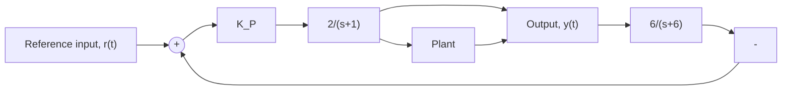

# 10.4 Figure P10.4 shows a closed-loop control system.

flowchart

Figure P10.4

a. Compute the controller gain $K _ { P }$ so that the undamped natural frequency of the closed-loop system is $\omega _ { n } = 4 \mathrm { r a d / s }$ .   
b. Compute the controller gain $K _ { P }$ so that the damping ratio of the closed-loop system is $\zeta = 0 . 7$   
c. Compute the steady-state output for a step reference input $r ( t ) ~ = ~ 4 U ( t )$ and controller gain $K _ { P } = 2 .$ .
