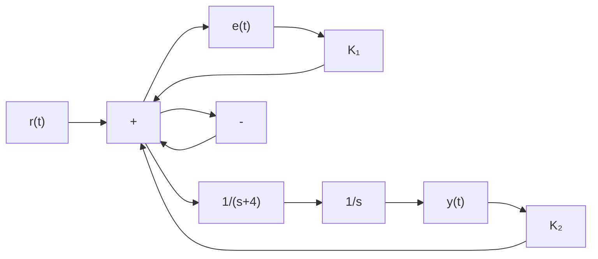

# 10.5 A closed-loop control system is shown in Fig. P10.5.

flowchart

Figure P10.5

a. Compute the closed-loop transfer function for the overall system, $T ( s ) = Y ( s ) / R ( s )$   
b. Two gain pairs are considered: Option 1 $( K _ { 1 } = 1 5 , K _ { 2 } = 2 )$ ) and Option $2 \left( K _ { 1 } = 3 0 , K _ { 2 } = 3 \right)$ ). Which gain pair provides the greatest closed-loop damping ratio? Justify your answer.

10.6 Figure P10.6 shows a unity-feedback closed-loop system. The reference input is a ramp, $r ( t ) = 0 . 2 t .$

flowchart

Figure P10.6

a. Compute the steady-state tracking error if the controller $G _ { C } ( s )$ is a simple proportional gain $K _ { P } = 2$   
b. Compute the steady-state tracking error if we use a PI controller with gains $K _ { P } = 3$ and $K _ { I } = 1 . 5$

10.7 A simple closed-loop PI control system is shown in Fig. P10.7.

flowchart

Figure P10.7

a. Show that the closed-loop system is stable for PI gains $K _ { P } = 5$ and $K _ { I } = 2 5$ .   
b. Determine “by hand” the closed-loop output y(t) at time t = 8 s if the reference input is a ramp function $r ( t ) = 1 . 4 t .$ . Use the PI gains from part (a).
