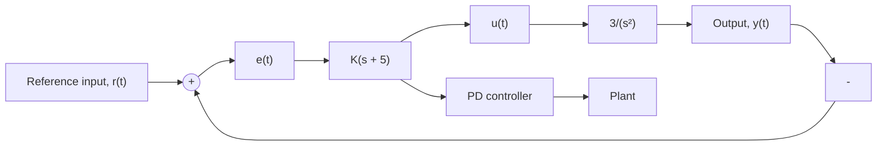

# MATLAB Problems

10.8 Refer back to the general closed-loop control system shown in Fig. P10.1 and the system transfer functions presented in Problem 10.1a repeated below

$$G _ {C} (s) = K _ {P} \qquad G _ {P} (s) = \frac {6}{s + 2} \qquad H (s) = 1$$

a. Use MATLAB to compute the closed-loop transfer function T(s) if the P-gain is $K _ { P } = 3$ and verify your answer in Problem 10.1a.   
b. Compute the roots of the closed-loop transfer function and estimate the unit-step response characteristics such as settling time and steady-state response. Does the closed-loop unit-step response exhibit oscillations? Explain.   
c. Create two Simulink models: one using the block diagram shown in Fig. P10.1 and another using the closed-loop transfer function T(s). Simulate the unit-step response, $r ( t ) = U ( t )$ , using both Simulink models and plot output y(t). Verify that both Simulink models produce the same results and verify your step-response calculations from part (b).

10.9 Repeat all parts of Problem 10.8 using the system transfer functions from Problem 10.1c

$$G _ {C} (s) = K _ {P} \qquad G _ {P} (s) = \frac {8}{s ^ {2} (s + 6)} \qquad H (s) = 1$$

The P-gain is $K _ { P } = 5 .$

10.10 Repeat all parts of Problem 10.8 using the system transfer functions from Problem 10.1d

$$G _ {C} (s) = K _ {P} \qquad G _ {P} (s) = \frac {1}{s ^ {2} + 6 s + 1 0} \qquad H (s) = 2$$

The P-gain is $K _ { P } = 4 .$

10.11 Repeat all parts of Problem 10.8 using the system transfer functions from Problem 10.1g

$$G _ {C} (s) = \frac {K _ {P} s + K _ {I}}{s} \qquad G _ {P} (s) = \frac {2}{(s + 1) (s + 4)} \qquad H (s) = 1$$

The P-gain is $K _ { P } = 0 . 3$ and the I-gain is $K _ { I } = 2 $ .

10.12 Figure P10.12 shows a closed-loop system with a “pure inertia plant,” where the plant I/O equation is $\ddot { y } = 3 u$ .

flowchart

Figure P10.12

a. Compute (“by hand”) the controller gain K so that the closed-loop roots have a damping ratio $\zeta = 0 . 7 0 7 1$ .   
b. Verify your answer in part (a) by using MATLAB’s rlocus and rlocfind commands.

10.13 A simple closed-loop system is shown in Fig. P10.13.
