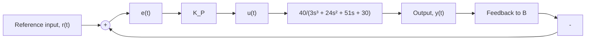
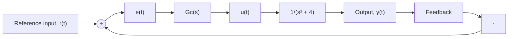

flowchart

Figure P10.13

a. Use MATLAB to create the root-locus plot if the controller is a simple proportional gain.   
b. Use MATLAB’s rlocus or rlocfind command(s) to determine the proportional control gain $K _ { P }$ for marginal stability. Compute the closed-loop poles for the marginally stable case.   
c. Use Simulink to simulate the marginally stable P-controller found in part (b). Let the reference input be a unit-step function. Plot the closed-loop response y(t) and show that the frequency of oscillation for the marginally stable case matches the appropriate marginally stable closed-loop poles.

10.14 Consider again the PI controller in Problem 10.7 and Fig. P10.7. Use Simulink to obtain the closed-loop response y(t) for a ramp input $r ( t ) = 1 . 4 t .$ . Use the PI gains $K _ { P } = 5$ and $K _ { I } = 2 5$ . Plot y(t) and r(t) on the same figure for a simulation time of 8 s.

10.15 Figure P10.15 shows a unity-feedback control system.

flowchart

Figure P10.15

a. Use MATLAB to create a root-locus plot for a closed-loop system that uses pure PD control $G _ { C } ( s ) =$ $K ( s + 1 )$ . Use rlocus and/or rlocfind to estimate the control gain K so that closed-loop damping ratio is $\zeta = 0 . 7 0 7 1$ .   
b. Now consider the more realistic lead controller instead of pure PD control: $G _ { C } ( s ) = K ( s + 1 ) / ( s + 1 0 )$ . Use MATLAB to create the root locus. Use rlocus and/or rlocfind to compute the gain K that provides the maximum amount of closed-loop damping.   
c. Use Simulink to obtain the closed-loop responses using the PD controller from part (a) and the lead controller from part (b). The reference input is $r ( t ) = 0 . 2 U ( t )$ ) in both cases. Plot both closed-loop responses on the same figure.
