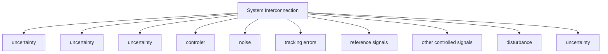
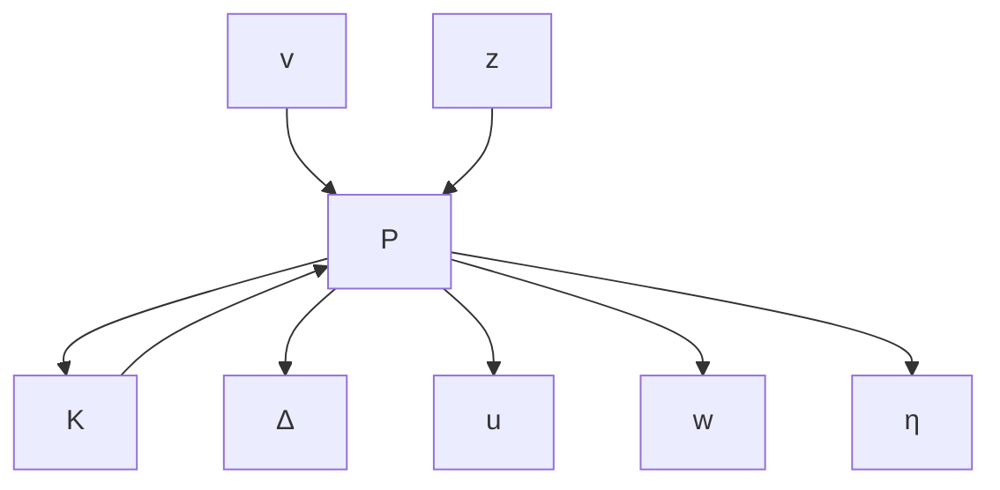

# 1.1 What Is This Book About?

This book is about basic robust and $\mathcal { H } _ { \infty }$ control theory. We consider a control system with possibly multiple sources of uncertainties, noises, and disturbances as shown in Figure 1.1.

flowchart

Figure 1.1: General system interconnection

We consider mainly two types of problems:

• Analysis problems: Given a controller, determine if the controlled signals (including tracking errors, control signals, etc.) satisfy the desired properties for all admissible noises, disturbances, and model uncertainties.   
• Synthesis problems: Design a controller so that the controlled signals satisfy the desired properties for all admissible noises, disturbances, and model uncertainties.

Most of our analysis and synthesis will be done on a unified linear fractional transformation (LFT) framework. To that end, we shall show that the system shown in Figure 1.1 can be put in the general diagram in Figure 1.2, where P is the interconnection matrix, K is the controller, ∆ is the set of all possible uncertainty, w is a vector signal including noises, disturbances, and reference signals, z is a vector signal including all controlled signals and tracking errors, u is the control signal, and y is the measurement.

flowchart

Figure 1.2: General LFT framework

The block diagram in Figure 1.2 represents the following equations:

$$
\left[ \begin{array}{l} v \\ z \\ y \end{array} \right] = P \left[ \begin{array}{l} \eta \\ w \\ u \end{array} \right]
\eta = \Delta vu = K y.
$$
