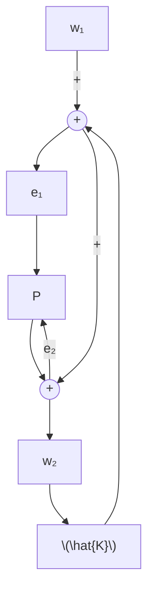

# 1.2 Highlights of This Book

The key results in each chapter are highlighted in this section. Readers should consult the corresponding chapters for the exact statements and conditions.

Chapter 2 reviews some basic linear algebra facts.

Chapter 3 reviews system theoretical concepts: controllability, observability, stabilizability, detectability, pole placement, observer theory, system poles and zeros, and state-space realizations.

Chapter 4 introduces the $\mathcal { H } _ { 2 }$ spaces and the $\mathcal { H } _ { \infty }$ spaces. State-space methods of computing real rational $\mathcal { H } _ { 2 }$ and $\mathcal { H } _ { \infty }$ transfer matrix norms are presented. For example, let

$$
G (s) = \left[ \begin{array}{c c} A & B \\ \hline C & 0 \end{array} \right] \in \mathcal {R H} _ {\infty}.
$$

Then

$$\| G \| _ {2} ^ {2} = \operatorname{trace} (B ^ {*} Q B) = \operatorname{trace} (C P C ^ {*})$$

and

$$\| G \| _ {\infty} = \max \{\gamma : H \mathrm{hasaneigenvalueontheimaginaryaxis} \},$$

where P and $Q$ are the controllability and observability Gramians and

$$
H = \left[ \begin{array}{c c} A & B B ^ {*} / \gamma^ {2} \\ - C ^ {*} C & - A ^ {*} \end{array} \right].
$$

Chapter 5 introduces the feedback structure and discusses its stability.

flowchart

We define that the above closed-loop system is internally stable if and only if

$$
\left[ \begin{array}{c c} I & - \hat {K} \\ - P & I \end{array} \right] ^ {- 1} = \left[ \begin{array}{c c} (I - \hat {K} P) ^ {- 1} & \hat {K} (I - P \hat {K}) ^ {- 1} \\ P (I - \hat {K} P) ^ {- 1} & (I - P \hat {K}) ^ {- 1} \end{array} \right] \in \mathcal {R H} _ {\infty}.
$$

Alternative characterizations of internal stability using coprime factorizations are also presented.

Chapter 6 considers the feedback system properties and design limitations. The formulations of optimal $\mathcal { H } _ { 2 }$ and $\mathcal { H } _ { \infty }$ control problems and the selection of weighting functions are also considered in this chapter.

Chapter 7 considers the problem of reducing the order of a linear multivariable dynamical system using the balanced truncation method. Suppose
