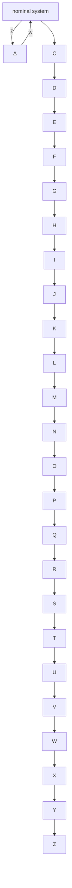
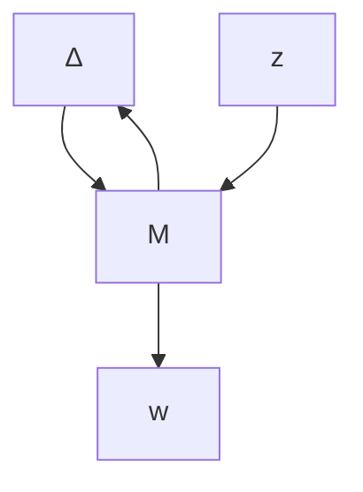

$$
G (s) = \left[ \begin{array}{c c c} A _ {1 1} & A _ {1 2} & B _ {1} \\ A _ {2 1} & A _ {2 2} & B _ {2} \\ \hline C _ {1} & C _ {2} & D \end{array} \right] \in \mathcal {R H} _ {\infty}
$$

is a balanced realization with controllability and observability Gramians $P = Q = \Sigma =$ diag $\left( \Sigma _ { 1 } , \Sigma _ { 2 } \right)$

$$\Sigma_ {1} = \mathrm{diag} (\sigma_ {1} I _ {s _ {1}}, \sigma_ {2} I _ {s _ {2}}, \ldots , \sigma_ {r} I _ {s _ {r}})\Sigma_ {2} = \mathrm{diag} (\sigma_ {r + 1} I _ {s _ {r + 1}}, \sigma_ {r + 2} I _ {s _ {r + 2}}, \ldots , \sigma_ {N} I _ {s _ {N}}).$$

Then the truncated system $G _ { r } ( s ) = \left[ { \frac { A _ { 1 1 } } { C _ { 1 } } } \bigg | { \cal B } _ { 1 } \right]$ is stable and satisfies an additive error bound:

$$\| G (s) - G _ {r} (s) \| _ {\infty} \leq 2 \sum_ {i = r + 1} ^ {N} \sigma_ {i}.$$

Frequency-weighted balanced truncation method is also discussed.

Chapter 8 derives robust stability tests for systems under various modeling assumptions through the use of the small gain theorem. In particular, we show that a system, shown at the top of the following page, with an unstructured uncertainty $\Delta \in \mathcal { R } \mathcal { H } _ { \infty }$ with $\| \Delta \| _ { \infty } < 1$ is robustly stable if and only if $\| T _ { z w } \| _ { \infty } \leq 1$ , where $T _ { z w }$ is the matrix transfer function from w to z.

flowchart

Chapter 9 introduces the LFT in detail. We show that many control problems can be formulated and treated in the LFT framework. In particular, we show that every analysis problem can be put in an LFT form with some structured $\Delta ( s )$ and some interconnection matrix $M ( s )$ and every synthesis problem can be put in an LFT form with a generalized plant $G ( s )$ and a controller $K ( s )$ to be designed.

flowchart

flowchart

