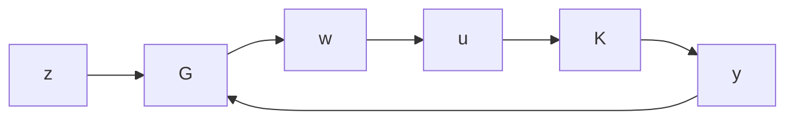
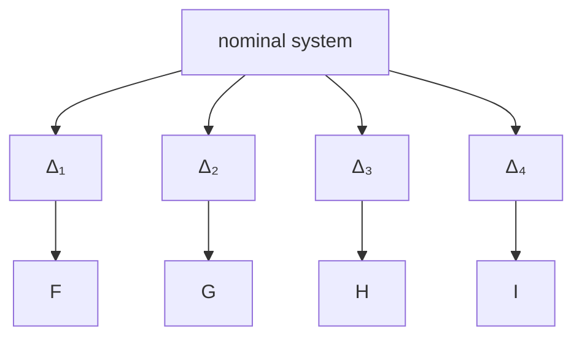

</details>

Chapter 10 considers robust stability and performance for systems with multiple sources of uncertainties. We show that an uncertain system is robustly stable and satisfies some $\mathcal { H } _ { \infty }$ performance criterion for all $\Delta _ { i } \in \mathcal { R } \mathcal { H } _ { \infty }$ with $\| \Delta _ { i } \| _ { \infty } < 1$ if and only if the structured singular value $( \mu )$ of the corresponding interconnection model is no greater than 1.


<details>
<summary>flowchart</summary>


</details>

Chapter 11 characterizes in state-space all controllers that stabilize a given dynamical system $G ( s )$ . For a given generalized plant

$$
G (s) = \left[ \begin{array}{l l} G _ {1 1} (s) & G _ {1 2} (s) \\ G _ {2 1} (s) & G _ {2 2} (s) \end{array} \right] = \left[ \begin{array}{c c c} A & B _ {1} & B _ {2} \\ \hline C _ {1} & D _ {1 1} & D _ {1 2} \\ C _ {2} & D _ {2 1} & D _ {2 2} \end{array} \right]
$$

we show that all stabilizing controllers can be parameterized as the transfer matrix from y to u below where F and L are such that $A + L C _ { 2 }$ and $A + B _ { 2 } F$ are stable and where $Q$ is any stable proper transfer matrix.


<details>
<summary>flowchart</summary>

```mermaid
graph TD
    z --> G
    w --> G
    G --> y
    y --> C2
    y --> D22
    y --> A
    y --> F
    C2 --> ∫
    ∫ --> B2
    B2 --> y1
    y1 --> Q
    Q --> -L
    -L --> C2
    C2 --> A
    A --> ∫
    ∫ --> B2
    B2 --> F
    F --> y1
    y1 --> C2
    C2 --> -
```
</details>

Chapter 12 studies the stabilizing solution to an algebraic Riccati equation (ARE). A solution to the following ARE

$$A ^ {*} X + X A + X R X + Q = 0$$

is said to be a stabilizing solution if $A + R X$ is stable. Now let

$$
H := \left[ \begin{array}{c c} A & R \\ - Q & - A ^ {*} \end{array} \right]
$$

and let X (H) be the stable H invariant subspace and

$$
\mathcal {X} _ {-} (H) = \mathrm{Im} \left[ \begin{array}{l} X _ {1} \\ X _ {2} \end{array} \right],
$$
