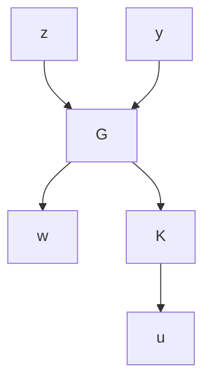

where $X _ { 1 } , X _ { 2 } \in \mathbb { C } ^ { n \times n }$ . If $X _ { 1 }$ is nonsingular, then $X : = X _ { 2 } X _ { 1 } ^ { - 1 }$ is uniquely determined by $H _ { \cdot }$ denoted by $X = \operatorname { R i c } ( H )$ . A key result of this chapter is the so-called bounded real lemma, which states that a stable transfer matrix $G ( s )$ satisfies $\| G ( s ) \| _ { \infty } < \gamma$ if and only if there exists an X such that $A + B B ^ { * } X / \gamma ^ { 2 }$ is stable and

$$X A + A ^ {*} X + X B B ^ {*} X / \gamma^ {2} + C ^ {*} C = 0.$$

The $\mathcal { H } _ { \infty }$ control theory in Chapter 14 will be derived based on this lemma.

Chapter 13 treats the optimal control of linear time-invariant systems with quadratic performance criteria (i.e., H2 problems). We consider a dynamical system described by an LFT with

$$
G (s) = \left[ \begin{array}{c c c} A & B _ {1} & B _ {2} \\ \hline C _ {1} & 0 & D _ {1 2} \\ C _ {2} & D _ {2 1} & 0 \end{array} \right].
$$

flowchart

Define

$$
R _ {1} = D _ {1 2} ^ {*} D _ {1 2} > 0, \quad R _ {2} = D _ {2 1} D _ {2 1} ^ {*} > 0
H _ {2} := \left[ \begin{array}{c c} A - B _ {2} R _ {1} ^ {- 1} D _ {1 2} ^ {*} C _ {1} & - B _ {2} R _ {1} ^ {- 1} B _ {2} ^ {*} \\ - C _ {1} ^ {*} (I - D _ {1 2} R _ {1} ^ {- 1} D _ {1 2} ^ {*}) C _ {1} & - (A - B _ {2} R _ {1} ^ {- 1} D _ {1 2} ^ {*} C _ {1}) ^ {*} \end{array} \right]

J _ {2} := \left[ \begin{array}{c c} (A - B _ {1} D _ {2 1} ^ {*} R _ {2} ^ {- 1} C _ {2}) ^ {*} & - C _ {2} ^ {*} R _ {2} ^ {- 1} C _ {2} \\ - B _ {1} (I - D _ {2 1} ^ {*} R _ {2} ^ {- 1} D _ {2 1}) B _ {1} ^ {*} & - (A - B _ {1} D _ {2 1} ^ {*} R _ {2} ^ {- 1} C _ {2}) \end{array} \right]
X _ {2} := \operatorname{Ric} (H _ {2}) \geq 0, \quad Y _ {2} := \operatorname{Ric} (J _ {2}) \geq 0F _ {2} := - R _ {1} ^ {- 1} (B _ {2} ^ {*} X _ {2} + D _ {1 2} ^ {*} C _ {1}), \quad L _ {2} := - (Y _ {2} C _ {2} ^ {*} + B _ {1} D _ {2 1} ^ {*}) R _ {2} ^ {- 1}.
$$

Then the $\mathcal { H } _ { 2 }$ optimal controller $( \mathrm { i . e . }$ , the controller that minimizes $\| T _ { z w } \| _ { 2 } )$ is given by

$$
K _ {\mathrm{opt}} (s) := \left[ \begin{array}{c c} A + B _ {2} F _ {2} + L _ {2} C _ {2} & - L _ {2} \\ \hline F _ {2} & 0 \end{array} \right].
$$
