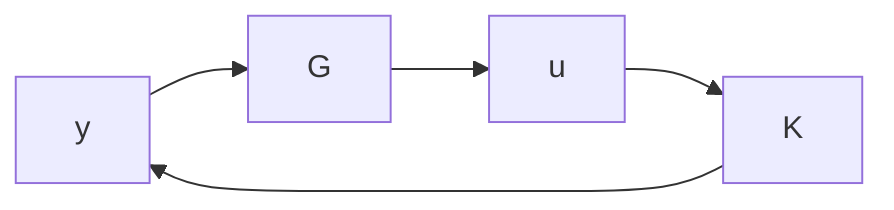

and the closed-loop poles consist of two parts: the poles resulting from state feedback $\lambda _ { i } ( A + B F )$ and the poles resulting from the state estimation $\lambda _ { j } ( A + L C )$ . Now if $( A , B )$ is controllable and $( C , A )$ is observable, then there exist F and L such that the eigenvalues of $A + B F$ and $A + L C$ can be arbitrarily assigned. In particular, they can be made to be stable. Note that a slightly weaker result can also result even if $( A , B )$ and $( C , A )$ are only stabilizable and detectable.

The controller given above is called an observer-based controller and is denoted as

$$u = K (s) y$$

and

$$
K (s) = \left[ \begin{array}{c c} A + B F + L C + L D F & - L \\ \hline F & 0 \end{array} \right].
$$

Now denote the open-loop plant by

$$
G = \left[ \begin{array}{c c} A & B \\ \hline C & D \end{array} \right];
$$

then the closed-loop feedback system is as shown below:

flowchart

In general, if a system is stabilizable through feeding back the output y, then it is said to be output feedback stabilizable. It is clear from the above construction that a system is output feedback stabilizable if and only if $( A , B )$ is stabilizable and $( C , A )$ is detectable.

Example 3.2 Let $A = { \left[ \begin{array} { l l } { 1 } & { 2 } \\ { 1 } & { 0 } \end{array} \right] } , B = { \left[ \begin{array} { l } { 1 } \\ { 0 } \end{array} \right] }$  , B =  10  , and $C = { \left[ \begin{array} { l l } { 1 } & { 0 } \end{array} \right] }$ . We shall design a state feedback $u = F x$ such that the closed-loop poles are at $\{ - 2 , - 3 \}$ . This can be done by choosing $F = { \left[ \begin{array} { l l } { - 6 } & { - 8 } \end{array} \right] }$ using

$$\gg F = - \operatorname{place} (A, B, [ - 2, - 3 ]).$$

Now suppose the states are not available for feedback and we want to construct an observer so that the observer poles are at $\{ - 1 0 , - 1 0 \}$ . Then $L = { \left[ \begin{array} { l } { - 2 1 } \\ { - 5 1 } \end{array} \right] }$ can be obtained by using

$$\gg L = - \mathrm{acker} (A ^ {\prime}, C ^ {\prime}, [ - 1 0, - 1 0 ]) ^ {\prime}$$

and the observer-based controller is given by

$$K (s) = \frac {- 5 3 4 (s + 0 . 6 9 6 6)}{(s + 3 4 . 6 5 6 4) (s - 8 . 6 5 6 4)}.$$

Note that the stabilizing controller itself is unstable. Of course, this may not be desirable in practice.
