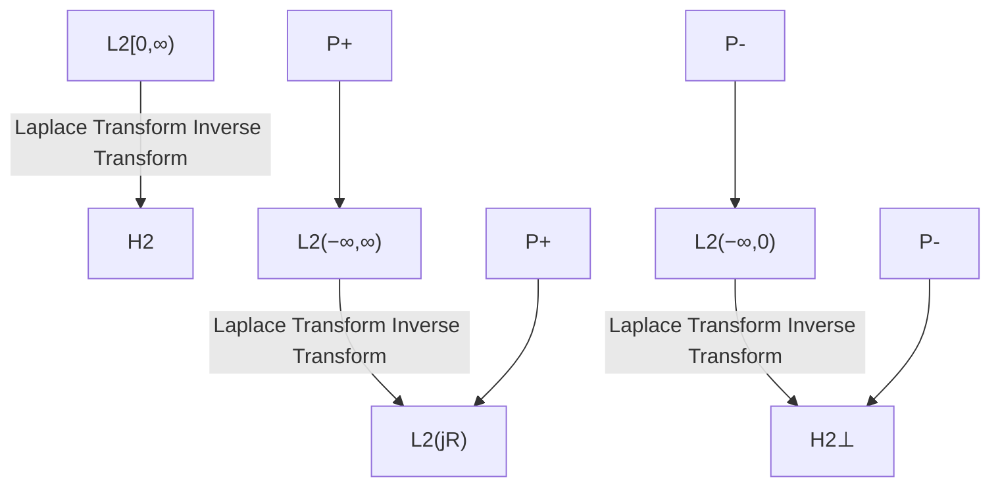

# $\mathcal { H } _ { 2 } ^ { \perp }$ Space

$\mathcal { H } _ { 2 } ^ { \perp }$ is the orthogonal complement of $\mathcal { H } _ { 2 }$ in $\mathcal { L } _ { 2 } ;$ that is, the (closed) subspace of functions in $\mathcal { L } _ { 2 }$ that are analytic in the open left-half plane. The real rational subspace of $\mathcal { H } _ { 2 } ^ { \perp }$ , which consists of all strictly proper rational transfer matrices with all poles in the open right-half plane, will be denoted by $\mathcal { R } \mathcal { H } _ { 2 } ^ { \perp }$ . It is easy to see that if $G$ is a strictly proper, stable, and real rational transfer matrix, then $G \in \mathcal { H } _ { 2 }$ and $G ^ { \sim } \in \mathcal { H } _ { 2 } ^ { \bot }$ . Most of our study in this book will be focused on the real rational case.

The $\mathcal { L } _ { 2 }$ spaces defined previously in the frequency domain can be related to the $\mathcal { L } _ { 2 }$ spaces defined in the time domain. Recall the fact that a function in $\mathcal { L } _ { 2 }$ space in the time domain admits a bilateral Laplace (or Fourier) transform. In fact, it can be shown that this bilateral Laplace transform yields an isometric isomorphism between the $\mathcal { L } _ { 2 }$ spaces in the time domain and the $\mathcal { L } _ { 2 }$ spaces in the frequency domain (this is what is called Parseval’s relations):

$$\mathcal {L} _ {2} (- \infty , \infty) \cong \mathcal {L} _ {2} (j \mathbb {R})\mathcal {L} _ {2} [ 0, \infty) \cong \mathcal {H} _ {2}\mathcal {L} _ {2} (- \infty , 0 ] \cong \mathcal {H} _ {2} ^ {\perp}.$$

As a result, if $g ( t ) \in \mathcal { L } _ { 2 } ( - \infty , \infty )$ and if its bilateral Laplace transform is $G ( s ) \in { \mathcal { L } } _ { 2 } ( j \mathbb { R } )$ , then

$$\| G \| _ {2} = \| g \| _ {2}.$$

Hence, whenever there is no confusion, the notation for functions in the time domain and in the frequency domain will be used interchangeably.

flowchart

Figure 4.1: Relationships among function spaces

Define an orthogonal projection

$$P _ {+}: \mathcal {L} _ {2} (- \infty , \infty) \longmapsto \mathcal {L} _ {2} [ 0, \infty)$$
