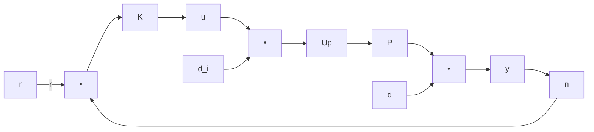

To focus our discussion, we shall consider the standard feedback configuration shown in Figure 5.1. It consists of the interconnected plant P and controller K forced by command $r ,$ sensor noise $n ,$ plant input disturbance $d _ { i } .$ , and plant output disturbance $d .$ In general, all signals are assumed to be multivariable, and all transfer matrices are assumed to have appropriate dimensions.

flowchart

Figure 5.1: Standard feedback configuration
