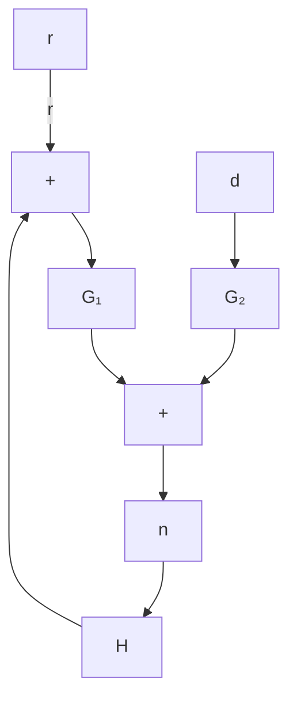

# 5.6 Problems

Problem 5.1 Recall that a feedback system is said to be internally stable if all closedloop transfer functions are stable. Describe the conditions for internal stability of the following feedback system:

flowchart

How can the stability conditions be simplified if $H ( s )$ and $G _ { 1 } ( s )$ are both stable?

Problem 5.2 Show that $\left[ \begin{array} { c c } { \boldsymbol { I } } & { - \hat { K } } \\ { - \boldsymbol { P } } & { \boldsymbol { I } } \end{array} \right] ^ { - 1 } \in \mathcal { R H } _ { \infty }$ if and only if

$$
\bar {A} := \left[ \begin{array}{c c} A & B \hat {C} \\ 0 & \hat {A} \end{array} \right] + \left[ \begin{array}{c} B \hat {D} \\ \hat {B} \end{array} \right] (I - D \hat {D}) ^ {- 1} \left[ \begin{array}{c c} C & D \hat {C} \end{array} \right]
$$

is stable.

Problem 5.3 Suppose N, $M , U , V \in \mathcal { R } \mathcal { H } _ { \infty }$ and $N M ^ { - 1 }$ and $U V ^ { - 1 }$ are right coprime factorizations, respectively. Show that

$$
\left[ \begin{array}{c c} M & 0 \\ 0 & V \end{array} \right] \left[ \begin{array}{c c} M & U \\ N & V \end{array} \right] ^ {- 1}
$$

is also a right coprime factorization.

Problem 5.4 Let $G ( s ) = \frac { s - 1 } { ( s + 2 ) ( s - 3 ) } .$ Find a stable coprime factorization $G =$ $n ( s ) / m ( s )$ and $x , y \in \mathcal { R } \mathcal { H } _ { \infty }$ such that $x n + y m = 1$ .

Problem 5.5 Let $N ( s ) = { \frac { ( s - 1 ) ( s + \alpha ) } { ( s + 2 ) ( s + 3 ) ( s + \beta ) } }$ and $M ( s ) = { \frac { ( s - 3 ) ( s + \alpha ) } { ( s + 3 ) ( s + \beta ) } }$ Show that $( N , M )$ is also a coprime factorization of the G in Problem 5.4 for any $\alpha > 0$ and $\beta > 0$ .

Problem 5.6 Let $G = N M ^ { - 1 }$ be a right coprime factorization over $\mathcal { R H } _ { \infty }$ . It is called a normalized coprime factorization if $N ^ { \sim } N + M ^ { \sim } M = I$ . Now consider scalar transfer function G. Then the following procedure can be used to find a normalized coprime factorization: (a) Let $G = n / m$ be any coprime factorization over $\mathcal { R } \mathcal { H } _ { \infty }$ . (b) Find a stable and minimum phase spectral factor w such that $w ^ { \sim } w = n ^ { \sim } n + m ^ { \sim } m$ . Let $N = n / w$ and $M = m / w ;$ then $G = N / M$ is a normalized coprime factorization. Find a normalized coprime factorization for Problem 5.4.
