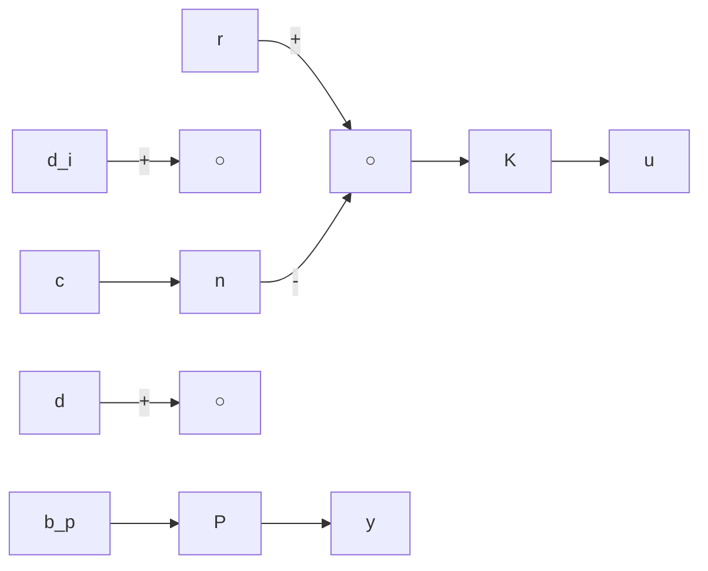

# 6.1 Feedback Properties

In this section, we discuss the properties of a feedback system. In particular, we consider the benefit of the feedback structure and the concept of design tradeoffs for conflicting objectives — namely, how to achieve the benefits of feedback in the face of uncertainties.

flowchart

Figure 6.1: Standard feedback configuration

Consider again the feedback system shown in Figure 5.1. For convenience, the system diagram is shown again in Figure 6.1. For further discussion, it is convenient to define the input loop transfer matrix, $L _ { i }$ , and output loop transfer matrix, $L _ { o } .$ , as

$$L _ {i} = K P, \quad L _ {o} = P K,$$

respectively, where $L _ { i }$ is obtained from breaking the loop at the input (u) of the plant while $L _ { o }$ is obtained from breaking the loop at the output $( y )$ of the plant. The input sensitivity matrix is defined as the transfer matrix from $d _ { i }$ to $u _ { p } \colon$

$$S _ {i} = (I + L _ {i}) ^ {- 1}, \quad u _ {p} = S _ {i} d _ {i}.$$

The output sensitivity matrix is defined as the transfer matrix from d to y:

$$S _ {o} = (I + L _ {o}) ^ {- 1}, \quad y = S _ {o} d.$$

The input and output complementary sensitivity matrices are defined as

$$T _ {i} = I - S _ {i} = L _ {i} (I + L _ {i}) ^ {- 1}T _ {o} = I - S _ {o} = L _ {o} (I + L _ {o}) ^ {- 1},$$

respectively. (The word complementary is used to signify the fact that T is the complement of $S , T = I - S . )$ The matrix $I + L _ { i }$ is called the input return difference matrix and $I + L _ { o }$ is called the output return difference matrix.

It is easy to see that the closed-loop system, if it is internally stable, satisfies the following equations:

$$y = T _ {o} (r - n) + S _ {o} P d _ {i} + S _ {o} d \tag {6.1}r - y = S _ {o} (r - d) + T _ {o} n - S _ {o} P d _ {i} \tag {6.2}u = K S _ {o} (r - n) - K S _ {o} d - T _ {i} d _ {i} \tag {6.3}u _ {p} = K S _ {o} (r - n) - K S _ {o} d + S _ {i} d _ {i}. \tag {6.4}$$
