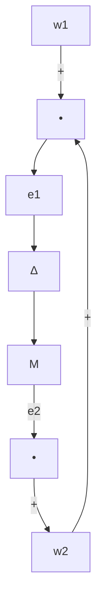

# 8.2 Small Gain Theorem

This section and the next section consider the stability test of a nominally stable system under unstructured perturbations. The basis for the robust stability criteria derived in the sequel is the so-called small gain theorem.

Consider the interconnected system shown in Figure 8.8 with $M ( s )$ a stable $p \times q$ transfer matrix.

Theorem 8.1 (Small Gain Theorem) Suppose $M \in \mathcal { R } \mathcal { H } _ { \infty }$ and let $\gamma > 0$ . Then the interconnected system shown in Figure 8.8 is well-posed and internally stable for all $\Delta ( s ) \in \mathcal { R H } _ { \infty }$ with

(a) $\| \Delta \| _ { \infty } \leq 1 / \gamma$ if and only if $\| M ( s ) \| _ { \infty } < \gamma$   
(b) $\| \Delta \| _ { \infty } < 1 / \gamma$ if and only $i f \parallel M ( s ) \parallel _ { \infty } \leq \gamma$

flowchart

Figure 8.8: M − ∆ loop for stability analysis

Proof. We shall only prove part (a). The proof for part (b) is similar. Without loss of generality, assume $\gamma = 1$ .

(Sufficiency) It is clear that $M ( s ) \Delta ( s )$ is stable since both $M ( s )$ and $\Delta ( s )$ are stable. Thus by Theorem 5.5 (or Corollary 5.4) the closed-loop system is stable if det $( I - M \Delta )$ has no zero in the closed right-half plane for all $\Delta \in \mathcal { R } \mathcal { H } _ { \infty }$ and $\| \Delta \| _ { \infty } \leq 1$ . Equivalently, the closed-loop system is stable if

$$\inf _ {s \in \overline {{\mathbb {C}}} _ {+}} \underline {{\sigma}} (I - M (s) \Delta (s)) \neq 0$$

for all $\Delta \in \mathcal { R } \mathcal { H } _ { \infty }$ and $\| \Delta \| _ { \infty } \leq 1$ . But this follows from

$$\inf _ {s \in \overline {{\mathbb {C}}} _ {+}} \underline {{\sigma}} \left(I - M (s) \Delta (s)\right) \geq 1 - \sup _ {s \in \overline {{\mathbb {C}}} _ {+}} \bar {\sigma} \left(M (s) \Delta (s)\right) = 1 - \| M (s) \Delta (s) \| _ {\infty} \geq 1 - \| M (s) \| _ {\infty} > 0.$$
