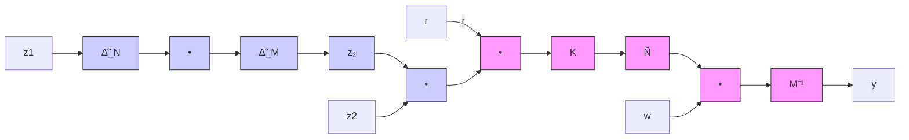

# 8.3.3 Coprime Factor Uncertainty

As another example, consider a left coprime factor perturbed plant described in Figure 8.11.

flowchart

Figure 8.11: Left coprime factor perturbed systems

Theorem 8.6 Let

$$\Pi = (\tilde {M} + \tilde {\Delta} _ {M}) ^ {- 1} (\tilde {N} + \tilde {\Delta} _ {N})$$

with $\tilde { M } , \tilde { N } , \tilde { \Delta } _ { M } , \tilde { \Delta } _ { N } \in \mathcal { R } \mathcal { H } _ { \infty }$ . The transfer matrices $( \tilde { M } , \tilde { N } )$ are assumed to be a stable left coprime factorization of $P ~ ( i . e . , ~ P ~ = ~ \tilde { M } ^ { - 1 } \tilde { N } )$ , and K internally stabilizes the nominal system P . Define $\Delta : = \left\lceil \begin{array} { l l } { \tilde { \Delta } _ { N } } & { \tilde { \Delta } _ { M } } \end{array} \right\rceil$ . Then the closed-loop system is wellposed and internally stable for all $\| \Delta \| _ { \infty } < 1$ if and only if

$$
\left\| \left[ \begin{array}{c} K \\ I \end{array} \right] (I + P K) ^ {- 1} \tilde {M} ^ {- 1} \right\| _ {\infty} \leq 1
$$

Proof. Let $K = U V ^ { - 1 }$ be a right coprime factorization over $\mathcal { R } \mathcal { H } _ { \infty }$ . By Lemma 5.7, the closed-loop system is internally stable if and only if

$$\left((\tilde {N} + \tilde {\Delta} _ {N}) U + (\tilde {M} + \tilde {\Delta} _ {M}) V\right) ^ {- 1} \in \mathcal {R H} _ {\infty} \tag {8.3}$$

Since K stabilizes $P , ( \tilde { N } U + \tilde { M } V ) ^ { - 1 } \in \mathcal { R } \mathcal { H } _ { \infty }$ . Hence equation (8.3) holds if and only if

$$\left(I + (\tilde {\Delta} _ {N} U + \tilde {\Delta} _ {M} V) (\tilde {N} U + \tilde {M} V) ^ {- 1}\right) ^ {- 1} \in \mathcal {R H} _ {\infty}$$

By the small gain theorem, the above is true for all $\| \Delta \| _ { \infty } < 1$ if and only if

$$
\left\| \left[ \begin{array}{l} U \\ V \end{array} \right] (\tilde {N} U + \tilde {M} V) ^ {- 1} \right\| _ {\infty} = \left\| \left[ \begin{array}{l} K \\ I \end{array} \right] (I + P K) ^ {- 1} \tilde {M} ^ {- 1} \right\| _ {\infty} \leq 1
$$

✷
