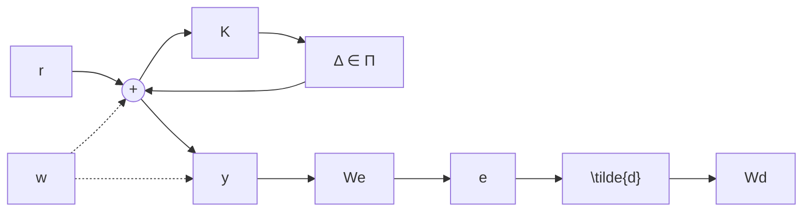

# 8.4 Robust Performance

Consider the perturbed system shown in Figure 8.12 with the set of perturbed models described by a set Π. Suppose the weighting matrices $W _ { d } , W _ { e } \in \mathcal { R } \mathcal { H } _ { \infty }$ and the perfor-

flowchart

Figure 8.12: Diagram for robust performance analysis

mance criterion is to keep the error e as small as possible in some sense for all possible models belonging to the set Π. In general, the set Π can be either a parameterized set or an unstructured set such as those described in Table 8.1. The performance specifications are usually specified in terms of the magnitude of each component e in the time domain with respect to bounded disturbances, or, alternatively and more conveniently, some requirements on the closed-loop frequency response of the transfer matrix between ˜d and e (say, integral of square error or the magnitude of the steady-state error with respect to sinusoidal disturbances). The former design criterion leads to the so-called $\mathcal { L } _ { 1 }$ -optimal control framework and the latter leads to $\mathcal { H } _ { 2 }$ and $\mathcal { H } _ { \infty }$ design frameworks, respectively. In this section, we will focus primarily on the $\mathcal { H } _ { \infty }$ performance objectives with unstructured model uncertainty descriptions. The performance under structured uncertainty will be considered in Chapter 10.

Suppose the performance criterion is to keep the worst-case energy of the error e as small as possible over all ˜d of unit energy, for example,

$$\sup _ {\left\| \tilde {d} \right\| _ {2} \leq 1} \| e \| _ {2} \leq \epsilon$$

for some small $\epsilon . \mathrm { \ B y }$ scaling the error $\it { \Delta } \mathrm { { } \it { e } \Psi \left( \mathrm { { i . e . } } \right. }$ , by properly selecting $W _ { e } )$ we can assume without loss of generality that $\epsilon = 1$ .

Let $T _ { e \tilde { d } }$ denote the transfer matrix between $\tilde { d }$ and e, then

$$T _ {e \tilde {d}} = W _ {e} (I + P _ {\Delta} K) ^ {- 1} W _ {d}, \quad P _ {\Delta} \in \boldsymbol {\Pi}. \tag {8.4}$$
