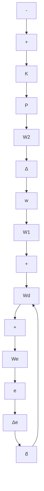

Remark 8.3 Suppose $\kappa ( W _ { 1 } ^ { - 1 } W _ { d } ) \approx 1$ (weighting matrices satisfying this condition are usually called round weights). This is particularly the case if $W _ { 1 } = w _ { 1 } ( s ) I$ and $W _ { d } = w _ { d } ( s ) I$ . Recall that $\overline { { \sigma } } ( W _ { e } S _ { o } W _ { d } ) \leq 1$ is the necessary and sufficient condition for nominal performance and that $\overline { { \sigma } } ( W _ { 2 } T _ { o } W _ { 1 } ) \leq 1$ is the necessary and sufficient condition for robust stability. Hence the condition (ii) in Theorem 8.7 is almost guaranteed by $\mathrm { N P + R S \ ( i . e . }$ , RP is almost guaranteed by NP + RS). Since RP implies NP + RS, we have $\mathrm { N P } + \mathrm { R S } \approx \mathrm { R P }$ . (In contrast, such a conclusion cannot be drawn in the skewed case, which will be considered in the next section.) Since condition (ii) implies $\mathrm { N P + R S }$ , we can also conclude that condition (ii) is almost equivalent to RP (i.e., beside being sufficient, it is almost necessary). ✸

Remark 8.4 Note that in light of the equivalence relation between the robust stability and nominal performance, it is reasonable to conjecture that the preceding robust performance problem is equivalent to the robust stability problem in Figure 8.9 with the uncertainty model set given by

$$\boldsymbol {\Pi} := (I + W _ {d} \Delta_ {e} W _ {e}) ^ {- 1} (I + W _ {1} \Delta W _ {2}) P$$

and $\left\| \Delta _ { e } \right\| _ { \infty } < 1 , \left\| \Delta \right\| _ { \infty } < 1$ , as shown in Figure 8.13. This conjecture is indeed true; however, the equivalent model uncertainty is structured, and the exact stability analysis for such systems is not trivial and will be studied in Chapter 10. ✸

flowchart

Figure 8.13: Robust performance with unstructured uncertainty vs. robust stability with structured uncertainty

Remark 8.5 Note that if $W _ { 1 }$ and $W _ { d }$ are invertible, then $T _ { e \tilde { d } }$ can also be written as

$$T _ {e \tilde {d}} = W _ {e} S _ {o} W _ {d} \left[ I + (W _ {1} ^ {- 1} W _ {d}) ^ {- 1} \Delta W _ {2} T _ {o} W _ {1} (W _ {1} ^ {- 1} W _ {d}) \right] ^ {- 1}.$$

So another alternative sufficient condition for robust performance can be obtained as

$$\overline {{\sigma}} (W _ {e} S _ {o} W _ {d}) + \kappa (W _ {1} ^ {- 1} W _ {d}) \overline {{\sigma}} (W _ {2} T _ {o} W _ {1}) \leq 1.$$

A similar situation also occurs in the skewed case below. We will not repeat all these variations. ✸
