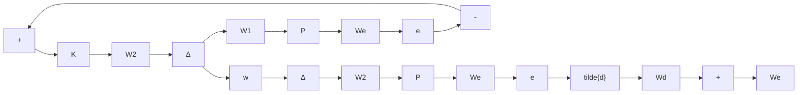

# 8.5 Skewed Specifications

We now consider the system with skewed specifications (i.e., the uncertainty and performance are not measured at the same location). For instance, the system performance is still measured in terms of output sensitivity, but the uncertainty model is in input multiplicative form:

$$\boldsymbol {\Pi} := \left\{P (I + W _ {1} \Delta W _ {2}): \Delta \in \mathcal {R H} _ {\infty}, \| \Delta \| _ {\infty} < 1 \right\}.$$

flowchart

Figure 8.14: Skewed problems

The system block diagram is shown in Figure 8.14.

For systems described by this class of models, the robust stability condition becomes

$$\left\| W _ {2} T _ {i} W _ {1} \right\| _ {\infty} \leq 1,$$

and the nominal performance condition becomes

$$\left\| W _ {e} S _ {o} W _ {d} \right\| _ {\infty} \leq 1.$$

To consider the robust performance, let $\tilde { T } _ { e \tilde { d } }$ denote the transfer matrix from $\tilde { d }$ to e. Then

$$
\begin{array}{l} \tilde {T} _ {e \tilde {d}} = W _ {e} S _ {o} (I + P W _ {1} \Delta W _ {2} K S _ {o}) ^ {- 1} W _ {d} \\ = W _ {e} S _ {o} W _ {d} \left[ I + (W _ {d} ^ {- 1} P W _ {1}) \Delta (W _ {2} T _ {i} W _ {1}) (W _ {d} ^ {- 1} P W _ {1}) ^ {- 1} \right] ^ {- 1}. \\ \end{array}
$$

The last equality follows if $W _ { 1 } , \ W _ { d }$ , and P are invertible and, if $W _ { 2 }$ is invertible, can also be written as

$$\tilde {T} _ {e \tilde {d}} = W _ {e} S _ {o} W _ {d} (W _ {1} ^ {- 1} W _ {d}) ^ {- 1} \left[ I + (W _ {1} ^ {- 1} P W _ {1}) \Delta (W _ {2} P ^ {- 1} W _ {2} ^ {- 1}) (W _ {2} T _ {o} W _ {1}) \right] ^ {- 1} (W _ {1} ^ {- 1} W _ {d}).$$

Then the following results follow easily.

Theorem 8.8 Suppose $P _ { \Delta } \in \mathbf { H } = \{ P ( I + W _ { 1 } \Delta W _ { 2 } ) : ~ \Delta \in \mathcal { R H } _ { \infty } , \| \Delta \| _ { \infty } < 1 \}$ and K internally stabilizes P . Assume that $P , W _ { 1 } , W _ { 2 } ,$ and $W _ { d }$ are square and invertible. Then the system robust performance is guaranteed if either one of the following conditions is satisfied:

(i) for each frequency ω

$$\overline {{\sigma}} (W _ {e} S _ {o} W _ {d}) + \kappa (W _ {d} ^ {- 1} P W _ {1}) \overline {{\sigma}} (W _ {2} T _ {i} W _ {1}) \leq 1; \tag {8.9}$$
