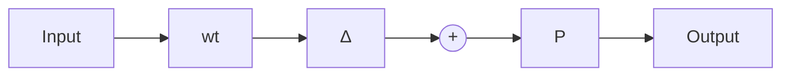

$$\tilde {T} _ {e \tilde {d}} = W _ {e} K ^ {- 1} (I + T _ {i} W _ {1} \Delta W _ {2}) ^ {- 1} S _ {i} K W _ {d}.$$

Assume further that $W _ { e } = I , W _ { d } = w _ { s } I , W _ { 2 } = I$ , where $w _ { s } \in \mathcal { R } \mathcal { H } _ { \infty }$ is a scalar function. Then a sufficient condition for robust performance is given by

$$\kappa (K) \overline {{\sigma}} (S _ {i} w _ {s}) + \overline {{\sigma}} (T _ {i} W _ {1}) \leq 1, \forall \omega ,$$

with $\kappa ( K ) : = \overline { { \sigma } } ( K ) \overline { { \sigma } } ( K ^ { - 1 } )$ . This is equivalent to treating the input multiplicative plant uncertainty as the output multiplicative controller uncertainty. ✸

The fact that the condition number appeared in the robust performance test for skewed problems can be given another interpretation by considering two sets of plants $\mathbf { I I } _ { 1 }$ and $\Pi _ { 2 }$ , as shown in Figure 8.15 and below.

$$\boldsymbol {\Pi} _ {1} := \left\{P (I + w _ {t} \Delta): \Delta \in \mathcal {R H} _ {\infty}, \| \Delta \| _ {\infty} < 1 \right\}\boldsymbol {\Pi} _ {2} := \left\{\left(I + \tilde {w} _ {t} \Delta\right) P: \Delta \in \mathcal {R H} _ {\infty}, \| \Delta \| _ {\infty} < 1 \right\}.$$

flowchart

flowchart

Figure 8.15: Converting input uncertainty to output uncertainty

Assume that P is invertible; then

$$\boldsymbol {\Pi} _ {2} \supseteq \boldsymbol {\Pi} _ {1} \quad \text { if } \quad | \tilde {w} _ {t} | \geq | w _ {t} | \kappa (P) \quad \forall \omega$$

since $P ( I + w _ { t } \Delta ) = ( I + w _ { t } P \Delta P ^ { - 1 } ) P .$

The condition number of a transfer matrix can be very high at high frequency, which may significantly limit the achievable performance. The example below, taken from the textbook by Franklin, Powell, and Workman [1990, page 788], shows that the condition number shown in Figure 8.16 may increase with the frequency:
