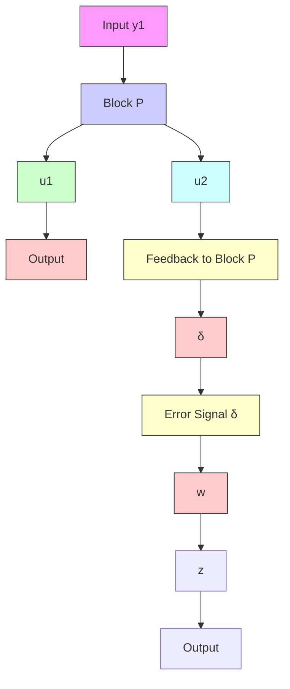

$$
P (s) = \frac {1}{s ^ {2} + a ^ {2}} \left[ \begin{array}{c c} s - a ^ {2} & a (s + 1) \\ - a (s + 1) & s - a ^ {2} \end{array} \right]
$$

Suppose the control law is chosen to be a unit feedback $u = - y .$ . Then the sensitivity function and the complementary sensitivity function are given by

$$
S = (I + P) ^ {- 1} = \frac {1}{s + 1} \left[ \begin{array}{c c} s & - a \\ a & s \end{array} \right], T = P (I + P) ^ {- 1} = \frac {1}{s + 1} \left[ \begin{array}{c c} 1 & a \\ - a & 1 \end{array} \right]
$$

Note that each single loop has the open-loop transfer function as ${ \frac { 1 } { s } } ,$ so each loop has $9 0 ^ { \mathrm { o } }$ phase margin and ∞ gain margin.

Suppose one loop transfer function is perturbed, as shown in Figure 8.18.

flowchart

Figure 8.18: One-loop-at-a-time analysis

Denote

$$\frac {z (s)}{w (s)} = - T _ {1 1} = - \frac {1}{s + 1}$$

Then the maximum allowable perturbation is given by

$$\| \delta \| _ {\infty} < \frac {1}{\| T _ {1 1} \| _ {\infty}} = 1,$$

which is independent of $a .$ Similarly the maximum allowable perturbation on the other loop is also 1 by symmetry. However, if both loops are perturbed at the same time, then the maximum allowable perturbation is much smaller, as shown next.

Consider a multivariable perturbation, as shown in Figure 8.19; that is, $P _ { \Delta } = ( I +$ $\Delta ) P$ , with

$$
\Delta = \left[ \begin{array}{c c} \delta_ {1 1} & \delta_ {1 2} \\ \delta_ {2 1} & \delta_ {2 2} \end{array} \right] \in \mathcal {R H} _ {\infty}
$$

a $2 \times 2$ transfer matrix such that $\| \Delta \| _ { \infty } < \gamma$ . Then by the small gain theorem, the system is robustly stable for every such $\Delta$ iff

$$\gamma \leq \frac {1}{\| T \| _ {\infty}} = \frac {1}{\sqrt {1 + a ^ {2}}} \quad (\ll 1 \text { if } a \gg 1).$$

