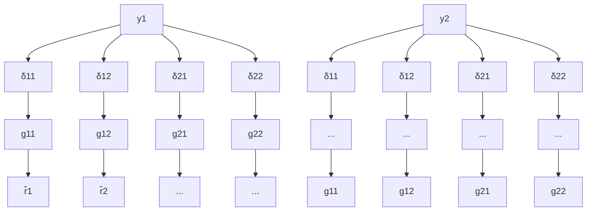

flowchart

Figure 8.19: Simultaneous perturbations

In particular, consider

$$
\Delta = \Delta_ {d} = \left[ \begin{array}{c c} \delta_ {1 1} & \\ & \delta_ {2 2} \end{array} \right] \in \mathbb {R} ^ {2 \times 2}.
$$

Then the closed-loop system is stable for every such $\Delta$ iff

$$\det (I + T \Delta_ {d}) = \frac {1}{(s + 1) ^ {2}} \left(s ^ {2} + (2 + \delta_ {1 1} + \delta_ {2 2}) s + 1 + \delta_ {1 1} + \delta_ {2 2} + (1 + a ^ {2}) \delta_ {1 1} \delta_ {2 2}\right)$$

has no zero in the closed right-half plane. Hence the stability region is given by

$$2 + \delta_ {1 1} + \delta_ {2 2} > 01 + \delta_ {1 1} + \delta_ {2 2} + (1 + a ^ {2}) \delta_ {1 1} \delta_ {2 2} > 0.$$

It is easy to see that the system is unstable with

$$\delta_ {1 1} = - \delta_ {2 2} = \frac {1}{\sqrt {1 + a ^ {2}}}.$$

The stability region for $a = 5$ is drawn in Figure 8.20, which shows how checking the axis misses nearby regions of instability, and that for $a > > 5 ,$ , things just get that much worse. The hyperbola portion of the picture gets arbitrarily close to (0,0). This clearly shows that the analysis of a MIMO system using SISO methods can be misleading and can even give erroneous results. Hence an MIMO method has to be used.
