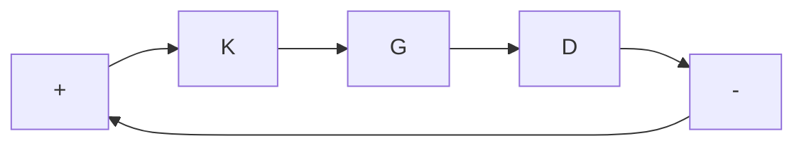

2. Here is an application of the preceding fact. Consider the unity feedback system with controller $k ( s )$ and plant $p ( s )$ , both SISO, with $k ( s )$ proper and $p ( s )$ strictly proper. Do coprime factorizations over $\mathcal { R H } _ { \infty }$ :

$$p = \frac {n _ {p}}{m _ {p}}, k = \frac {n _ {k}}{m _ {k}}.$$

Then the feedback system is internally stable iff $n _ { p } n _ { k } + m _ { p } m _ { k }$ is a unit in $\mathcal { R H } _ { \infty }$ . Assume it is a unit. Perturb $p ( s )$ to

$$p = \frac {n _ {p} + \Delta_ {n}}{m _ {p} + \Delta_ {m}}, \quad \Delta_ {n}, \Delta_ {m} \in \mathcal {R H} _ {\infty}.$$

Show that internal stability is preserved $\mathrm { i f } \parallel \Delta _ { n } \parallel _ { \infty }$ and $\| \Delta _ { m } \| _ { \infty }$ are small enough. The conclusion is that internal stability is preserved if the perturbations are small enough in the $\mathcal { H } _ { \infty }$ norm.

3. Give an example of a unit $f ( s )$ in $\mathcal { R H } _ { \infty }$ such that equation (8.11) fails for the $\mathcal { H } _ { 2 }$ norm, that is, such that

$$(\forall \epsilon > 0) (\exists g \in \mathcal {R H} _ {2}) \| g \| _ {2} < \epsilon \text { and } f + g \text { is not a unit. }$$

What is the significance of this fact concerning robust stability?

Problem 8.6 Let ∆ and M be square constant matrices. Prove that the following three conditions are equivalent:

$\left[ \begin{array} { c c } { I } & { - \Delta } \\ { - M } & { I } \end{array} \right]$ is invertible;   
2. $I - M \Delta$ is invertible;   
3. $I - \Delta M$ is invertible.

Problem 8.7 Consider the unity feedback system

flowchart

For

$$
G (s) = \left[ \begin{array}{l l} \frac {1}{s} & \frac {1}{s} \\ \frac {1}{s} & \frac {1}{s} \end{array} \right]
$$

design a proper controller $K ( s )$ to stabilize the feedback system internally. Now perturb $G ( s )$ to

$$
\left[ \begin{array}{c c} \frac {1 + \epsilon}{s} & \frac {1}{s} \\ \frac {1}{s} & \frac {1}{s} \end{array} \right], \quad \epsilon \in \mathbb {R}.
$$

Is the feedback system internally stable for all sufficiently small $\epsilon ?$
