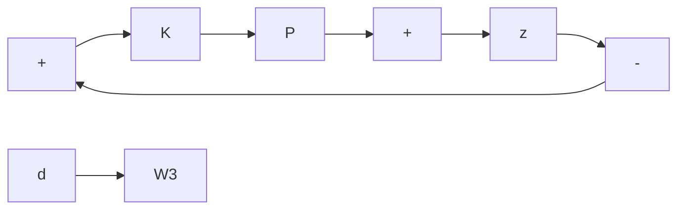

Let $a _ { i } : = ( a _ { i } ^ { - } + a _ { i } ^ { + } ) / 2$ and let

$$a _ {\mathrm{nom}} (s) = a _ {0} + a _ {1} s + a _ {2} s ^ {2} + \dots .$$

Find a least conservative $W ( s )$ such that

$$\frac {a (s)}{a _ {\mathrm{nom}} (s)} \in \left\{1 + W (s) \Delta (s) \mid \| \Delta \| _ {\infty} \leq 1 \right\}.$$

Problem 8.12 One of the main tools in this chapter was the small-gain theorem. One way to state it is as follows: Define a transfer matrix $F ( s )$ in $\mathcal { R H } _ { \infty }$ to be contractive if $\| F \| _ { \infty } \leq 1$ and strictly contractive if $\| F \| _ { \infty } < 1$ . Then for the unity feedback system the small gain theorem is this: If K is contractive and G is strictly contractive, then the feedback system is stable.

This problem concerns passivity and the passivity theorem. This is an important tool in the study of the stability of feedback systems, especially robotics, that is complementary to the small gain theorem.

Consider a system with a square transfer matrix $F ( s )$ in $\mathcal { R H } _ { \infty }$ . This is said to be passive if

$$F (j \omega) + F (j \omega) ^ {*} \geq 0, \quad \forall \omega .$$

Here, the symbol $\geq 0$ means that the matrix is positive semidefinite. If the system is SISO, the condition is equivalent to

$$\operatorname{Re} F (j \omega) \geq 0, \quad \forall \omega ;$$

that is, the Nyquist plot of F lies in the right-half plane. The system is strictly passive if $F - \epsilon I$ is passive for some $\epsilon > 0$ .

1. Consider a mechanical system with input vector $u ( t )$ (forces and torques) and output vector y(t) (velocities) modeled by the equation

$$M \dot {y} + K y = u$$

where M and K are symmetric, positive definite matrices. Show that this system is passive.

2. If F is passive, then $( I + F ) ^ { - 1 } \in \mathcal { R } \mathcal { H } _ { \infty }$ and $( I + F ) ^ { - 1 } ( I - F )$ is contractive; if F is strictly passive, then $( I + F ) ^ { - 1 } ( I - F )$ is strictly contractive. Prove these statements for the case that F is SISO.   
3. Using the results so far, show (in the MIMO case) that the unity feedback system is stable if K is passive and G is strictly passive.

Problem 8.13 Consider a SISO feedback system shown below with $P = P _ { o } + W _ { 2 } \Delta _ { 2 }$

flowchart

