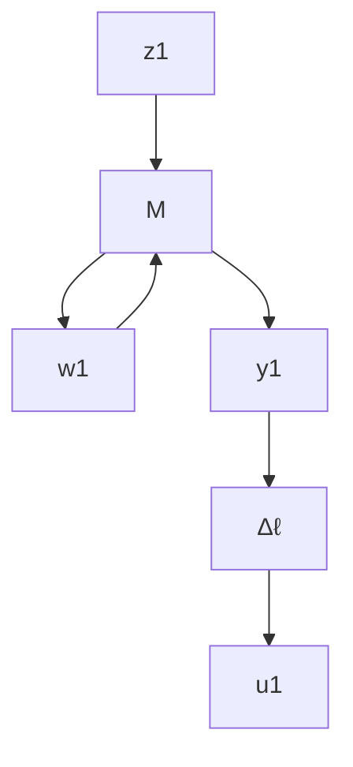
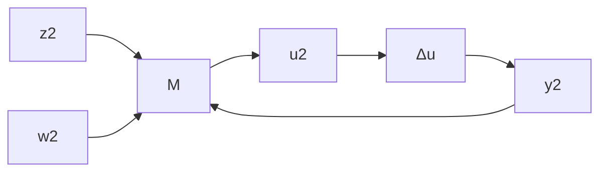

# 9.1 Linear Fractional Transformations

This section introduces the matrix linear fractional transformations. It is well known from the one-complex-variable function theory that a mapping $F : \mathbb { C } \mapsto \mathbb { C }$ of the form

$$F (s) = \frac {a + b s}{c + d s}$$

with $a , b , c ,$ and $d \in \mathbb { C }$ is called a linear fractional transformation. In particular, if $c \neq 0$ then $F ( s )$ can also be written as

$$F (s) = \alpha + \beta s (1 - \gamma s) ^ {- 1}$$

for some $\alpha , \beta$ and $\gamma \in \mathbb { C }$ . The linear fractional transformation described above for scalars can be generalized to the matrix case.

Definition 9.1 Let M be a complex matrix partitioned as

$$
M = \left[ \begin{array}{c c} M _ {1 1} & M _ {1 2} \\ M _ {2 1} & M _ {2 2} \end{array} \right] \in \mathbb {C} ^ {(p _ {1} + p _ {2}) \times (q _ {1} + q _ {2})},
$$

and let $\Delta _ { \ell } \in \mathbb { C } ^ { q _ { 2 } \times p _ { 2 } }$ and $\Delta _ { u } \in \mathbb { C } ^ { q _ { 1 } \times p _ { 1 } }$ be two other complex matrices. Then we can formally define a lower LFT with respect to $\Delta _ { \ell }$ as the map

$$\mathcal {F} _ {\ell} (M, \bullet): \mathbb {C} ^ {q _ {2} \times p _ {2}} \mapsto \mathbb {C} ^ {p _ {1} \times q _ {1}}$$

with

$$\mathcal {F} _ {\ell} (M, \Delta_ {\ell}) := M _ {1 1} + M _ {1 2} \Delta_ {\ell} (I - M _ {2 2} \Delta_ {\ell}) ^ {- 1} M _ {2 1}$$

provided that the inverse $( I - M _ { 2 2 } \Delta _ { \ell } ) ^ { - 1 }$ exists. We can also define an upper LFT with respect to $\Delta _ { u }$ as

$$\mathcal {F} _ {u} (M, \bullet): \mathbb {C} ^ {q _ {1} \times p _ {1}} \mapsto \mathbb {C} ^ {p _ {2} \times q _ {2}}$$

with

$$\mathcal {F} _ {u} (M, \Delta_ {u}) = M _ {2 2} + M _ {2 1} \Delta_ {u} (I - M _ {1 1} \Delta_ {u}) ^ {- 1} M _ {1 2}$$

provided that the inverse $( I - M _ { 1 1 } \Delta _ { u } ) ^ { - 1 }$ exists.

The matrix M in the preceding LFTs is called the coefficient matrix. The motivation for the terminologies of lower and upper LFTs should be clear from the following diagram representations of $\mathcal { F } _ { \ell } ( M , \Delta _ { \ell } )$ and $\mathcal { F } _ { u } ( M , \Delta _ { u } )$ ):

flowchart

flowchart

