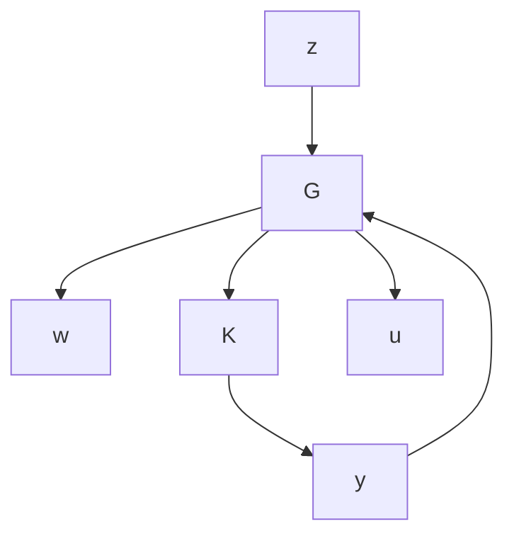

# Simple Block Diagrams

A feedback system with the following block diagram

```mermaid
graph LR
    A["Input"] --> B["W1"]
    B --> C["K"]
    C --> D["u"]
    D --> E["+"]
    E --> F["P"]
    F --> G["W2"]
    G --> H["v"]
    H --> I["n"]
    I --> J["F"]
    J --> K["-"]
    K --> L["y"]
    L --> M["+"]
    M --> N["u"]
    N --> O["d"]
    O --> P["+"]
    P --> Q["w"]
    Q --> R["Output"]
```

flowchart

can be rearranged as an LFT:

flowchart

with

$$
w = \left( \begin{array}{c} d \\ n \end{array} \right), z = \left( \begin{array}{c} v \\ u _ {f} \end{array} \right), G = \left[ \begin{array}{c c c} W _ {2} P & 0 & W _ {2} P \\ 0 & 0 & W _ {1} \\ - F \bar {P} & - \bar {F} & - \bar {F} \bar {P} \end{array} \right].
$$

A state-space realization for the generalized plant G can be obtained by directly realizing the transfer matrix G using any standard multivariable realization techniques (e.g., Gilbert realization). However, the direct realization approach is usually complicated. Here we shall show another way to obtain the realization for G based on the realizations of each component. To simplify the expression, we shall assume that the plant P is strictly proper and $P , F , W _ { 1 }$ , and $W _ { 2 }$ have, respectively, the following state-space realizations:

$$
P = \left[ \begin{array}{c c} A _ {p} & B _ {p} \\ \hline C _ {p} & 0 \end{array} \right], F = \left[ \begin{array}{c c} A _ {f} & B _ {f} \\ \hline C _ {f} & D _ {f} \end{array} \right], W _ {1} = \left[ \begin{array}{c c} A _ {u} & B _ {u} \\ \hline C _ {u} & D _ {u} \end{array} \right], W _ {2} = \left[ \begin{array}{c c} A _ {v} & B _ {v} \\ \hline C _ {v} & D _ {v} \end{array} \right].
$$

That is,

$$\dot {x} _ {p} = A _ {p} x _ {p} + B _ {p} (d + u), y _ {p} = C _ {p} x _ {p},\dot {x} _ {f} = A _ {f} x _ {f} + B _ {f} (y _ {p} + n), - y = C _ {f} x _ {f} + D _ {f} (y _ {p} + n),\dot {x} _ {u} = A _ {u} x _ {u} + B _ {u} u, \quad u _ {f} = C _ {u} x _ {u} + D _ {u} u,\dot {x} _ {v} = A _ {v} x _ {v} + B _ {v} y _ {p}, v = C _ {v} x _ {v} + D _ {v} y _ {p}.$$

Now define a new state vector

$$
x = \left[ \begin{array}{l} x _ {p} \\ x _ {f} \\ x _ {u} \\ x _ {v} \end{array} \right]
$$

and eliminate the variable $y _ { p }$ to get a realization of G as

$$\dot {x} = A x + B _ {1} w + B _ {2} uz = C _ {1} x + D _ {1 1} w + D _ {1 2} uy = C _ {2} x + D _ {2 1} w + D _ {2 2} u$$

with
