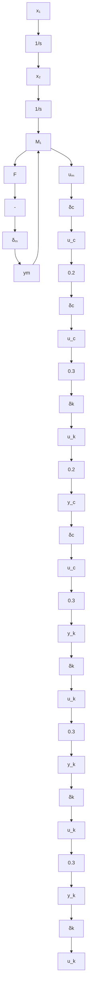

```mermaid
graph TD
    A["x"] --> B["1/s"]
    B --> C["ẋ"]
    C --> D["1/s"]
    D --> E["ẋ"]
    E --> F["1/(m̄(1+0.1δₘ))"]
    F --> G["+"]
    G --> H["+"]
    H --> I["ȳ(1+0.3δₖ)"]
    I --> J["ȳ(1+0.2δc)"]
    J --> K["+"]
    K --> L["F"]
    L --> M["+"]
    M --> N["ȳ(1+0.3δₖ)"]
    N --> O["ȳ(1+0.2δc)"]
    O --> P["+"]
    P --> Q["+"]
    Q --> R["ȳ(1+0.3δₖ)"]
    R --> S["+"]
    S --> T["ȳ(1+0.2δc)"]
    T --> U["+"]
    U --> V["+"]
    V --> W["ȳ(1+0.3δₖ)"]
    W --> X["+"]
    X --> Y["ȳ(1+0.2δc)"]
    Y --> Z["+"]
    Z --> AA["+"]
    AA --> AB["ȳ(1+0.3δₖ)"]
    AB --> AC["+"]
    AC --> AD["ȳ(1+0.2δc)"]
    AD --> AE["+"]
    AE --> AF["+"]
    AF --> AG["ȳ(1+0.3δₖ)"]
    AG --> AH["+"]
    AH --> AI["ȳ(1+0.2δc)"]
    AI --> AJ["+"]
    AJ --> AK["+"]
    AK --> AL["ȳ(1+0.3δₖ)"]
    AL --> AM["+"]
    AM --> AN["ȳ(1+0.2δc)"]
    AN --> AO["+"]
    AO --> AP["+"]
    AP --> AQ["ȳ(1+0.3δₖ)"]
    AQ --> AR["+"]
    AR --> AS["ȳ(1+0.2δc)"]
    AS --> AT["+"]
    AT --> AU["+"]
    AU --> AV["ȳ(1+0.3δₖ)"]
    AV --> AW["+"]
    AW --> AX["ȳ(1+0.2δc)"]
    AX --> AY["+"]
    AY --> AZ["+"]
    AZ --> BA["ȳ(1+0.3δₖ)"]
    BA --> BB["+"]
    BB --> BC["ȳ(1+0.2δc)"]
    BC --> BD["+"]
    BD --> BE["+"]
    BE --> BF["ȳ(1+0.3δₖ)"]
    BF --> BG["+"]
    BG --> BH["ȳ(1+0.2δc)"]
    BH --> BI["+"]
    BI --> BJ["+"]
    BJ --> BK["ȳ(1+0.3δₖ)"]
```

Figure 9.2: Block diagram of mass/spring/damper equation

flowchart

```mermaid
graph TD
    x1["x₁"] --> A["1/s"]
    A --> x2["x₂"]
    x2 --> B["1/s"]
    B --> C["M₁"]
    C --> D["F"]
    D --> E["-"]
    E --> F["δₘ"]
    F --> G["ym"]
    G --> C
    C --> H["uₘ"]
    H --> I["δc"]
    I --> J["u_c"]
    J --> K["0.2"]
    K --> L["δc"]
    L --> M["u_c"]
    M --> N["0.3"]
    N --> O["δk"]
    O --> P["u_k"]
    P --> Q["0.2"]
    Q --> R["y_c"]
    R --> S["δc"]
    S --> T["u_c"]
    T --> U["0.3"]
    U --> V["y_k"]
    V --> W["δk"]
    W --> X["u_k"]
    X --> Y["0.3"]
    Y --> Z["y_k"]
    Z --> AA["δk"]
    AA --> AB["u_k"]
    AB --> AC["0.3"]
    AC --> AD["y_k"]
    AD --> AE["δk"]
    AE --> AF["u_k"]
```

Figure 9.3: A block diagram for the mass/spring/damper system with uncertain parameters

Then
