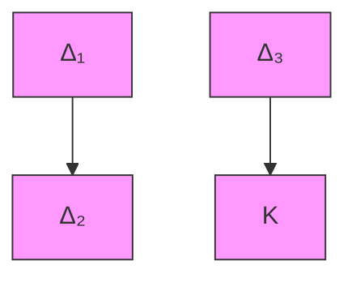
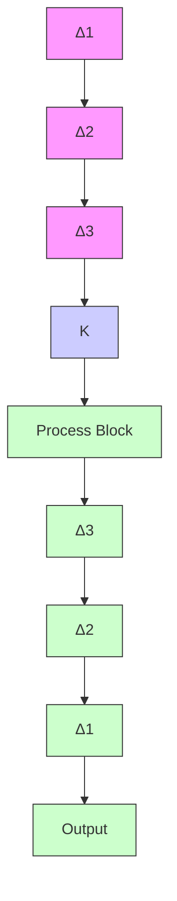

# 9.2 Basic Principle

We have studied two simple examples of the use of LFTs and, in particular, their role in modeling uncertainty. The basic principle at work here in writing a matrix LFT is often referred to as “pulling out the $\Delta { \mathit { } s } ^ { \prime \prime }$ . We will try to illustrate this with another picture. Consider a structure with four substructures interconnected in some known way, as shown in Figure 9.4. This diagram can be redrawn as a standard one via “pulling out the $\Delta { \ ' } _ { \mathrm { s } } { \ ' }$ in Figure 9.5.

Now the matrix M of the LFT can be obtained by computing the corresponding transfer matrix in the shadowed box.

We shall illustrate the preceding principle with an example. Consider an input/output relation

$$z = \frac {a + b \delta_ {2} + c \delta_ {1} \delta_ {2} ^ {2}}{1 + d \delta_ {1} \delta_ {2} + e \delta_ {1} ^ {2}} w =: G w$$

where $a , b , c , d ,$ and e are given constants or transfer functions. We would like to write $G$ as an LFT in terms of $\delta _ { 1 }$ and $\delta _ { 2 }$ . We shall do this in three steps:

1. Draw a block diagram for the input/output relation with each $\delta$ separated as shown in Figure 9.6.

flowchart

Figure 9.4: Multiple source of uncertain structure

flowchart

Figure 9.5: Pulling out the $\Delta \mathrm { { s } }$

flowchart

